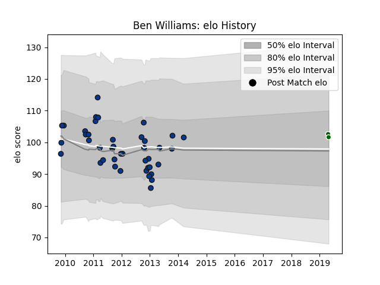

---  
layout: page  
title: Ben Williams  
date: 2023-02-24 02:34:06.511077  
categories: player  
---
# Ben Williams

## Positions: C

## Current elo: 102.0

## Current Percentile: None

# Elo History

# Match History

| Team                |   Appearances |   Win Rate |
|:--------------------|--------------:|-----------:|
| Bath Rugby          |            41 |    0.54878 |
| Ealing Trailfinders |             2 |    0.5     |

| Opponent            |   Matches |   Win Rate |
|:--------------------|----------:|-----------:|
| Exeter Chiefs       |         6 |       0.75 |
| Saracens            |         5 |       0    |
| Leicester Tigers    |         4 |       0.75 |
| Northampton Saints  |         3 |       0    |
| Newcastle Falcons   |         3 |       1    |
| Agen                |         2 |       1    |
| Bucuresti           |         2 |       1    |
| Calvisano           |         2 |       1    |
| Sale Sharks         |         2 |       0.5  |
| Harlequins          |         2 |       0.25 |
| Montpellier Herault |         1 |       0    |
| Wasps               |         1 |       0    |
| Ospreys             |         1 |       1    |
| Leinster            |         1 |       0    |
| London Welsh        |         1 |       0    |
| London Irish        |         1 |       0    |
| Bedford             |         1 |       1    |
| Gloucester Rugby    |         1 |       0    |
| Edinburgh           |         1 |       1    |
| Cardiff Blues       |         1 |       1    |
| Bordeaux Begles     |         1 |       1    |
| Worcester Warriors  |         1 |       0.5  |