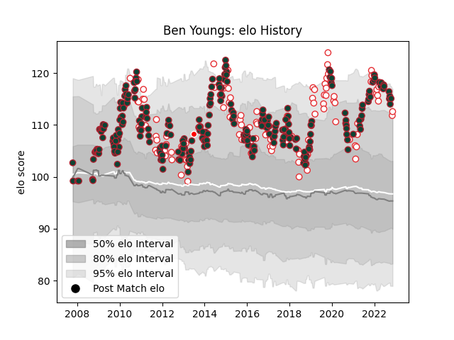

---  
layout: page  
title: Ben Youngs  
date: 2023-03-17 17:42:04.575770  
categories: player  
---
# Ben Youngs

## Positions: SH

## Country: England

## Current elo: 91.0

## Current Percentile: 34.0

# Elo History

# Match History

| Team                    |   Appearances |   Win Rate |
|:------------------------|--------------:|-----------:|
| Leicester Tigers        |           303 |   0.633663 |
| England                 |           121 |   0.64876  |
| British and Irish Lions |             2 |   0.5      |

| Opponent                 |   Matches |   Win Rate |
|:-------------------------|----------:|-----------:|
| Northampton Saints       |        28 |   0.660714 |
| Bath Rugby               |        22 |   0.545455 |
| Harlequins               |        20 |   0.7      |
| Gloucester Rugby         |        20 |   0.775    |
| Wasps                    |        19 |   0.421053 |
| Saracens                 |        19 |   0.421053 |
| Sale Sharks              |        18 |   0.611111 |
| Newcastle Falcons        |        17 |   0.823529 |
| Australia                |        17 |   0.764706 |
| Exeter Chiefs            |        16 |   0.625    |
| London Irish             |        15 |   0.866667 |
| Wales                    |        14 |   0.571429 |
| South Africa             |        13 |   0.307692 |
| France                   |        13 |   0.615385 |
| Scotland                 |        13 |   0.692308 |
| Worcester Warriors       |        12 |   0.916667 |
| Ireland                  |        12 |   0.583333 |
| Italy                    |        12 |   1        |
| New Zealand              |        11 |   0.227273 |
| Benetton Treviso         |         9 |   1        |
| Bristol Rugby            |         8 |   0.5625   |
| Ulster                   |         8 |   0.25     |
| Racing 92                |         7 |   0.142857 |
| Clermont Auvergne        |         7 |   0.571429 |
| Munster                  |         6 |   0.5      |
| Ospreys                  |         6 |   0.333333 |
| Scarlets                 |         6 |   0.666667 |
| Argentina                |         5 |   0.8      |
| Leeds                    |         4 |   1        |
| Stade Toulousain         |         4 |   0.5      |
| Toulon                   |         4 |   0.25     |
| Samoa                    |         3 |   1        |
| Perpignan                |         3 |   0.5      |
| Stade Francais Paris     |         3 |   0.666667 |
| Yorkshire Carnegie       |         3 |   1        |
| Leinster                 |         3 |   0.333333 |
| Fiji                     |         3 |   1        |
| Montpellier Herault      |         3 |   0.666667 |
| Arix Viadana             |         2 |   1        |
| Glasgow Warriors         |         2 |   0        |
| Tonga                    |         2 |   1        |
| Connacht                 |         2 |   1        |
| Pau                      |         1 |   1        |
| Castres Olympique        |         1 |   1        |
| Barbarians               |         1 |   0        |
| Calvisano                |         1 |   1        |
| Casa Montepaschi Viadana |         1 |   1        |
| United States of America |         1 |   1        |
| Edinburgh                |         1 |   1        |
| Dragons                  |         1 |   1        |
| Georgia                  |         1 |   1        |
| Japan                    |         1 |   1        |
| Romania                  |         1 |   1        |
| London Welsh             |         1 |   1        |