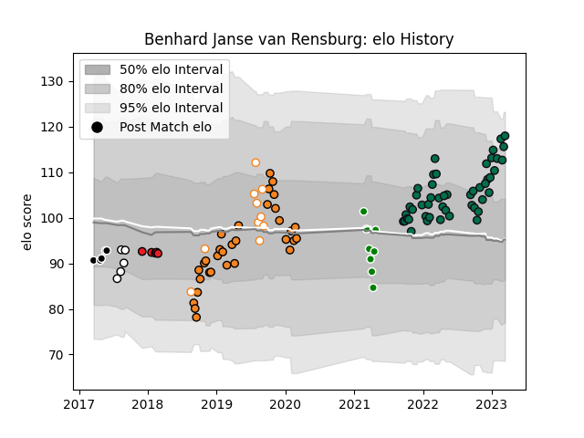

---  
layout: page  
title: Benhard Janse van Rensburg  
date: 2022-11-16 11:21:54.979090  
categories: player  
---
# Benhard Janse van Rensburg

## Positions: C

## Current elo: 94.0

## Current Percentile: 29.0

# Elo History

# Match History

| Team                  |   Appearances |   Win Rate |
|:----------------------|--------------:|-----------:|
| London Irish          |            32 |   0.421875 |
| Cheetahs              |            29 |   0.396552 |
| Free State Cheetahs   |             7 |   0.571429 |
| Green Rockets Tokatsu |             6 |   0        |
| Sharks                |             5 |   0.9      |
| Southern Kings        |             5 |   0        |
| Natal Sharks          |             4 |   0.75     |

| Opponent              |   Matches |   Win Rate |
|:----------------------|----------:|-----------:|
| Southern Kings        |         6 |   1        |
| Ospreys               |         4 |   0.25     |
| Zebre                 |         3 |   0.666667 |
| Northampton Saints    |         3 |   0        |
| Harlequins            |         3 |   0.333333 |
| Sale Sharks           |         3 |   0.333333 |
| Gloucester Rugby      |         3 |   0.166667 |
| Edinburgh             |         3 |   0.333333 |
| Exeter Chiefs         |         3 |   0.666667 |
| Ulster                |         3 |   0.166667 |
| Cardiff Blues         |         3 |   0.333333 |
| Bristol Rugby         |         3 |   0.333333 |
| Worcester Warriors    |         3 |   0.666667 |
| Leicester Tigers      |         2 |   0        |
| Scarlets              |         2 |   0        |
| Saracens              |         2 |   0.75     |
| Wasps                 |         2 |   0.25     |
| Western Province      |         2 |   1        |
| Newcastle Falcons     |         2 |   1        |
| Munster               |         2 |   0        |
| Bath Rugby            |         2 |   0.5      |
| Free State Cheetahs   |         2 |   0.5      |
| Golden Lions          |         2 |   0.5      |
| Blue Bulls            |         2 |   0.5      |
| Connacht              |         2 |   0        |
| Dragons               |         2 |   0.5      |
| Glasgow Warriors      |         2 |   0        |
| Leinster              |         2 |   0        |
| Pumas                 |         1 |   1        |
| Saitama Wild Knights  |         1 |   0        |
| Griquas               |         1 |   1        |
| Hino Red Dolphins     |         1 |   0        |
| Melbourne Rebels      |         1 |   0.5      |
| Shizuoka Blue Revs    |         1 |   0        |
| Jaguares              |         1 |   1        |
| Stormers              |         1 |   1        |
| Sunwolves             |         1 |   1        |
| Natal Sharks          |         1 |   0        |
| Cheetahs              |         1 |   0        |
| Kobelco Kobe Steelers |         1 |   0        |
| Black Rams Tokyo      |         1 |   0        |
| Yokohama Canon Eagles |         1 |   0        |
| Benetton Treviso      |         1 |   1        |