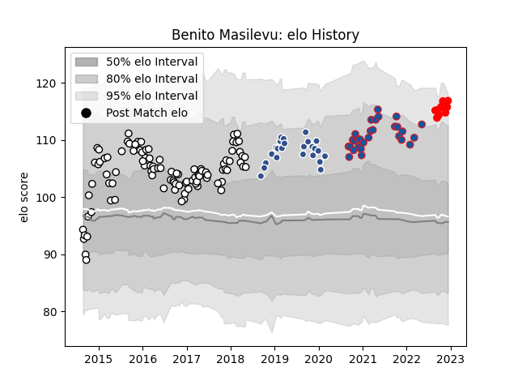

---  
layout: page  
title: Benito Masilevu  
date: 2023-01-15 12:03:23.694891  
categories: player  
---
# Benito Masilevu

## Positions: W

## Country: Fiji

## Current elo: 113.0

## Current Percentile: 83.0

# Elo History

# Match History

| Team     |   Appearances |   Win Rate |
|:---------|--------------:|-----------:|
| Brive    |            93 |   0.456989 |
| Grenoble |            33 |   0.469697 |
| Agen     |            24 |   0.291667 |
| Rouen    |            10 |   0.6      |
| Fiji     |             6 |   0.333333 |

| Opponent                   |   Matches |   Win Rate |
|:---------------------------|----------:|-----------:|
| Bordeaux Begles            |        10 |   0.25     |
| Clermont Auvergne          |         9 |   0.111111 |
| Toulon                     |         8 |   0.375    |
| Stade Francais Paris       |         8 |   0.5      |
| La Rochelle                |         8 |   0.375    |
| Racing 92                  |         7 |   0.428571 |
| Oyonnax                    |         7 |   0.714286 |
| Montpellier Herault        |         7 |   0.714286 |
| Grenoble                   |         6 |   0.166667 |
| Stade Toulousain           |         6 |   0.416667 |
| Castres Olympique          |         6 |   0.5      |
| Lyon                       |         5 |   0.5      |
| Agen                       |         4 |   0.5      |
| RC Enisei                  |         4 |   0.75     |
| Pau                        |         4 |   0        |
| Mont-de-Marsan             |         4 |   0.75     |
| Worcester Warriors         |         4 |   0.75     |
| Bayonne                    |         4 |   0.25     |
| Carcassonne                |         4 |   0.25     |
| Rouen                      |         3 |   0.666667 |
| Vannes                     |         3 |   0.666667 |
| Provence Rugby             |         3 |   0        |
| Aurillac                   |         3 |   0.333333 |
| Colomiers                  |         3 |   0.333333 |
| Perpignan                  |         3 |   0.333333 |
| Nevers                     |         3 |   1        |
| Newcastle Falcons          |         2 |   0.5      |
| Benetton Treviso           |         2 |   0.5      |
| Brive                      |         2 |   1        |
| Biarritz Olympique         |         2 |   0.5      |
| Soyaux-Angouleme           |         2 |   0.5      |
| Montauban                  |         2 |   0.75     |
| Connacht                   |         2 |   0.5      |
| Edinburgh                  |         2 |   0        |
| Valence Romans Drome Rugby |         2 |   1        |
| Australia                  |         1 |   0        |
| Bath Rugby                 |         1 |   0        |
| Wasps                      |         1 |   0        |
| Georgia                    |         1 |   0        |
| Scotland                   |         1 |   1        |
| Beziers                    |         1 |   0        |
| England                    |         1 |   0        |
| New Zealand Maori          |         1 |   0        |
| Narbonne                   |         1 |   1        |
| Italy                      |         1 |   1        |
| Harlequins                 |         1 |   0        |
| Massy                      |         1 |   1        |