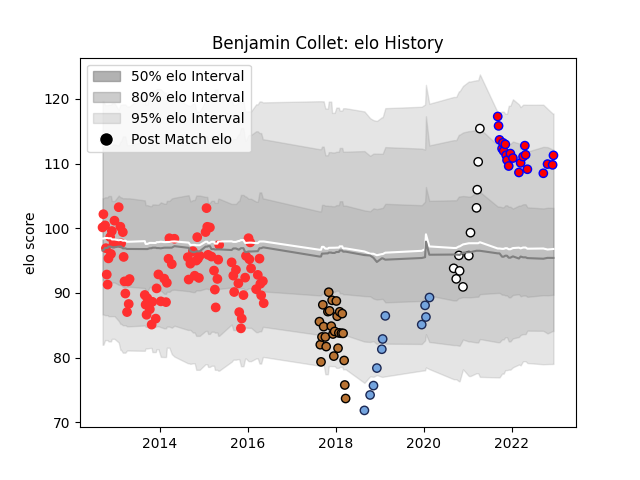

---  
layout: page  
title: Benjamin Collet  
date: 2022-12-18 16:29:32.574265  
categories: player  
---
# Benjamin Collet

## Positions: FL

## Current elo: 111.0

## Current Percentile: 87.0

# Elo History

# Match History

| Team                       |   Appearances |   Win Rate |
|:---------------------------|--------------:|-----------:|
| Tarbes                     |            85 |   0.570588 |
| Narbonne                   |            27 |   0.259259 |
| Blagnac                    |            22 |   0.5      |
| Bayonne                    |            11 |   0.5      |
| Valence Romans Drome Rugby |            11 |   0.454545 |

| Opponent                   |   Matches |   Win Rate |
|:---------------------------|----------:|-----------:|
| Colomiers                  |        11 |   0.590909 |
| Carcassonne                |        11 |   0.545455 |
| Beziers                    |        10 |   0.55     |
| Mont-de-Marsan             |         9 |   0.444444 |
| Dax                        |         9 |   0.444444 |
| Massy                      |         8 |   0.625    |
| Narbonne                   |         7 |   0.642857 |
| Aurillac                   |         7 |   0.428571 |
| Albi                       |         7 |   0.571429 |
| Bourgoin-Jallieu           |         6 |   0.5      |
| Provence Rugby             |         6 |   0.5      |
| Montauban                  |         5 |   0.3      |
| Perpignan                  |         4 |   0.25     |
| Lyon                       |         4 |   0.75     |
| Biarritz Olympique         |         4 |   0.5      |
| Soyaux-Angouleme           |         4 |   0.25     |
| Nevers                     |         3 |   0        |
| Suresnes                   |         3 |   0.666667 |
| Grenoble                   |         3 |   0.166667 |
| La Rochelle                |         3 |   0.666667 |
| Bayonne                    |         3 |   0.333333 |
| Auch                       |         3 |   0.666667 |
| US Bressane                |         3 |   0.666667 |
| Pau                        |         3 |   0.166667 |
| Tarbes                     |         2 |   1        |
| Vannes                     |         2 |   0.5      |
| Dijon                      |         2 |   0.5      |
| Brive                      |         2 |   0        |
| Aubenas                    |         2 |   1        |
| Nice                       |         1 |   1        |
| Oyonnax                    |         1 |   1        |
| Montpellier Herault        |         1 |   0        |
| London Irish               |         1 |   1        |
| Scarlets                   |         1 |   0        |
| Cognac Saint Jean d'Angély |         1 |   0        |
| Chambery                   |         1 |   0        |
| Toulon                     |         1 |   0        |
| Valence Romans Drome Rugby |         1 |   0        |
| Agen                       |         1 |   1        |