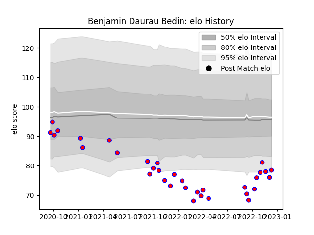

---  
layout: page  
title: Benjamin Daurau Bedin  
date: 2022-12-14 11:20:11.702365  
categories: player  
---
# Benjamin Daurau Bedin

## Positions: W, FB

## Current elo: 78.0

## Current Percentile: 3.0

# Elo History

# Match History

| Team    |   Appearances |   Win Rate |
|:--------|--------------:|-----------:|
| Blagnac |            33 |   0.530303 |

| Opponent                   |   Matches |   Win Rate |
|:---------------------------|----------:|-----------:|
| Suresnes                   |         4 |   0.5      |
| Albi                       |         3 |   0.333333 |
| Bourgoin-Jallieu           |         3 |   0.666667 |
| Cognac Saint Jean d'Angély |         3 |   0.666667 |
| Dax                        |         3 |   0.333333 |
| Narbonne                   |         2 |   0.25     |
| Tarbes                     |         2 |   1        |
| Nice                       |         2 |   0.5      |
| Massy                      |         2 |   0.5      |
| Valence Romans Drome Rugby |         2 |   0        |
| Aubenas                    |         1 |   1        |
| Dijon                      |         1 |   1        |
| Rennes                     |         1 |   1        |
| Soyaux-Angouleme           |         1 |   0        |
| Chambery                   |         1 |   1        |
| Carqueiranne-Hyères        |         1 |   1        |
| US Bressane                |         1 |   0        |