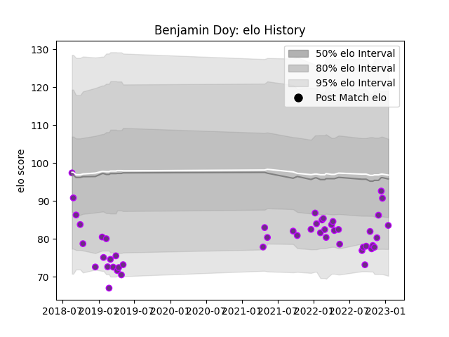

---  
layout: page  
title: Benjamin Doy  
date: 2023-03-17 17:13:10.839960  
categories: player  
---
# Benjamin Doy

## Positions: C

## Current elo: 82.0

## Current Percentile: 24.0

# Elo History

# Match History

| Team        |   Appearances |   Win Rate |
|:------------|--------------:|-----------:|
| US Bressane |            56 |   0.517857 |

| Opponent                   |   Matches |   Win Rate |
|:---------------------------|----------:|-----------:|
| Narbonne                   |         4 |   0.5      |
| Dax                        |         3 |   0.333333 |
| Aurillac                   |         3 |   0.666667 |
| Nevers                     |         3 |   0.333333 |
| Cognac Saint Jean d'Angély |         3 |   1        |
| Colomiers                  |         2 |   0.5      |
| Suresnes                   |         2 |   1        |
| Provence Rugby             |         2 |   0.25     |
| Oyonnax                    |         2 |   0        |
| Nice                       |         2 |   0.5      |
| Montauban                  |         2 |   0.5      |
| Grenoble                   |         2 |   0.5      |
| Albi                       |         2 |   0.5      |
| Agen                       |         2 |   1        |
| Chambery                   |         2 |   0.5      |
| Carqueiranne-Hyères        |         2 |   0.5      |
| Carcassonne                |         2 |   0        |
| Brive                      |         2 |   0.5      |
| Biarritz Olympique         |         2 |   0.5      |
| Bayonne                    |         2 |   0        |
| Vannes                     |         2 |   0.25     |
| Mont-de-Marsan             |         1 |   0        |
| Bourgoin-Jallieu           |         1 |   1        |
| Blagnac                    |         1 |   1        |
| Beziers                    |         1 |   1        |
| Rennes                     |         1 |   1        |
| Rouen                      |         1 |   1        |
| Soyaux-Angouleme           |         1 |   0        |
| Tarbes                     |         1 |   1        |