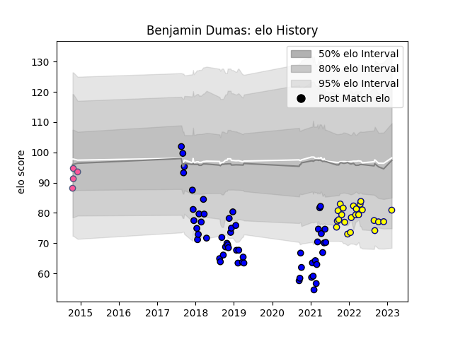

---  
layout: page  
title: Benjamin Dumas  
date: 2023-02-15 22:12:44.474108  
categories: player  
---
# Benjamin Dumas

## Positions: W, FB

## Current elo: 81.0

## Current Percentile: 11.0

# Elo History

# Match History

| Team                 |   Appearances |   Win Rate |
|:---------------------|--------------:|-----------:|
| Massy                |            54 |   0.37037  |
| Nevers               |            23 |   0.478261 |
| Stade Francais Paris |             4 |   0.5      |

| Opponent                   |   Matches |   Win Rate |
|:---------------------------|----------:|-----------:|
| Montauban                  |         6 |   0        |
| Oyonnax                    |         4 |   0.25     |
| Provence Rugby             |         4 |   0.25     |
| Beziers                    |         4 |   0.25     |
| Nevers                     |         4 |   0.25     |
| Carcassonne                |         4 |   0.5      |
| Soyaux-Angouleme           |         4 |   0.625    |
| Dax                        |         3 |   0.666667 |
| Aurillac                   |         3 |   0.333333 |
| Mont-de-Marsan             |         3 |   0.333333 |
| US Bressane                |         3 |   0.666667 |
| Colomiers                  |         3 |   0.333333 |
| Nice                       |         2 |   0        |
| Narbonne                   |         2 |   0.5      |
| Grenoble                   |         2 |   0.25     |
| Rouen                      |         2 |   1        |
| Chambery                   |         2 |   0.25     |
| Perpignan                  |         2 |   0.5      |
| Tarbes                     |         2 |   0.5      |
| Brive                      |         2 |   0.5      |
| Bourgoin-Jallieu           |         2 |   0.5      |
| Blagnac                    |         2 |   0.5      |
| Biarritz Olympique         |         2 |   0.5      |
| Bayonne                    |         2 |   0.25     |
| Aubenas                    |         2 |   1        |
| Suresnes                   |         1 |   1        |
| Agen                       |         1 |   0        |
| Dijon                      |         1 |   0        |
| Newcastle Falcons          |         1 |   0        |
| Dragons                    |         1 |   0        |
| Albi                       |         1 |   1        |
| Cognac Saint Jean d'Angély |         1 |   1        |
| Bucuresti                  |         1 |   1        |
| Bucarest Wolves            |         1 |   1        |
| Vannes                     |         1 |   0        |