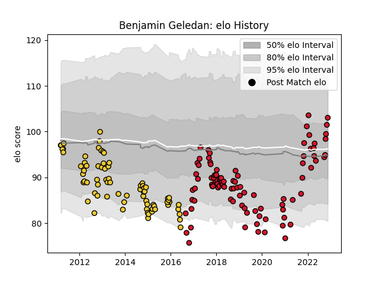

---  
layout: page  
title: Benjamin Geledan  
date: 2022-11-22 11:37:51.068382  
categories: player  
---
# Benjamin Geledan

## Positions: H

## Current elo: 103.0

## Current Percentile: 73.0

# Elo History

# Match History

| Team        |   Appearances |   Win Rate |
|:------------|--------------:|-----------:|
| Oyonnax     |            96 |   0.526042 |
| La Rochelle |            73 |   0.513699 |

| Opponent                   |   Matches |   Win Rate |
|:---------------------------|----------:|-----------:|
| Beziers                    |         9 |   0.722222 |
| Colomiers                  |         8 |   0.4375   |
| Biarritz Olympique         |         7 |   0.142857 |
| Montpellier Herault        |         7 |   0.5      |
| Aurillac                   |         6 |   0.166667 |
| Oyonnax                    |         6 |   0.333333 |
| Narbonne                   |         6 |   0.666667 |
| Carcassonne                |         6 |   0.833333 |
| Agen                       |         5 |   0.6      |
| Vannes                     |         5 |   0.6      |
| Soyaux-Angouleme           |         5 |   1        |
| Grenoble                   |         5 |   0.4      |
| Dax                        |         5 |   0.8      |
| Mont-de-Marsan             |         5 |   0.4      |
| Clermont Auvergne          |         5 |   0.2      |
| Brive                      |         5 |   0.2      |
| Provence Rugby             |         4 |   0.625    |
| Castres Olympique          |         4 |   0        |
| Stade Toulousain           |         4 |   0.375    |
| Lyon                       |         4 |   0.75     |
| Racing 92                  |         4 |   0        |
| Pau                        |         4 |   0.5      |
| Nevers                     |         4 |   0.75     |
| Bordeaux Begles            |         3 |   0.666667 |
| Worcester Warriors         |         3 |   0.333333 |
| Toulon                     |         3 |   0.666667 |
| Stade Francais Paris       |         3 |   0.5      |
| Connacht                   |         3 |   0        |
| Bourgoin-Jallieu           |         3 |   1        |
| Montauban                  |         3 |   0.666667 |
| Albi                       |         3 |   0.666667 |
| Massy                      |         3 |   1        |
| Rouen                      |         2 |   0.5      |
| Bayonne                    |         2 |   0.75     |
| La Rochelle                |         2 |   0.25     |
| Tarbes                     |         2 |   1        |
| US Bressane                |         2 |   1        |
| Auch                       |         2 |   1        |
| Exeter Chiefs              |         2 |   0        |
| Périgueux                  |         1 |   0        |
| Roval Drome XV             |         1 |   1        |
| Gloucester Rugby           |         1 |   0        |
| Valence Romans Drome Rugby |         1 |   1        |
| Zebre                      |         1 |   1        |