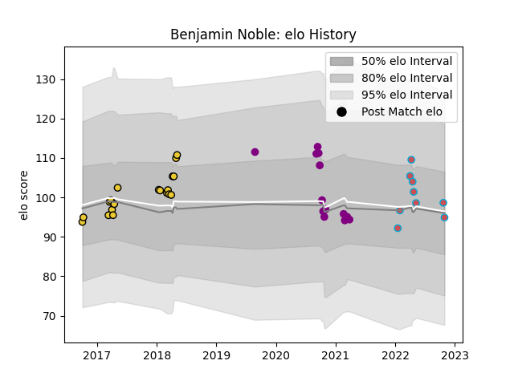

---  
layout: page  
title: Benjamin Noble  
date: 2023-03-27 11:33:04.624494  
categories: player  
---
# Benjamin Noble

Last updated: 2023-03-27
## Positions: FH, C

## Current elo: 95.0

## Current Percentile: 55.0

# Elo History

# Match History

| Team             |   Appearances |   Win Rate |
|:-----------------|--------------:|-----------:|
| La Rochelle      |            19 |   0.447368 |
| Soyaux-Angouleme |            13 |   0.230769 |
| Bourgoin-Jallieu |             9 |   0.277778 |

| Opponent                   |   Matches |   Win Rate |
|:---------------------------|----------:|-----------:|
| Nevers                     |         2 |       0.5  |
| Clermont Auvergne          |         2 |       0    |
| Lyon                       |         2 |       0.5  |
| Rouen                      |         2 |       0    |
| Pau                        |         2 |       0.5  |
| Stade Francais Paris       |         2 |       0.5  |
| Tarbes                     |         2 |       0    |
| Valence Romans Drome Rugby |         2 |       0.25 |
| Beziers                    |         2 |       1    |
| Stade Toulousain           |         1 |       0    |
| Toulon                     |         1 |       0.5  |
| Soyaux-Angouleme           |         1 |       0    |
| Scarlets                   |         1 |       0    |
| Ulster                     |         1 |       0    |
| Racing 92                  |         1 |       1    |
| Provence Rugby             |         1 |       0    |
| Perpignan                  |         1 |       0    |
| Albi                       |         1 |       0    |
| Oyonnax                    |         1 |       0    |
| Montpellier Herault        |         1 |       0    |
| Montauban                  |         1 |       0    |
| Massy                      |         1 |       0    |
| Harlequins                 |         1 |       1    |
| Edinburgh                  |         1 |       1    |
| Dijon                      |         1 |       1    |
| Colomiers                  |         1 |       0    |
| Castres Olympique          |         1 |       0    |
| Carcassonne                |         1 |       0    |
| Brive                      |         1 |       1    |
| Bordeaux Begles            |         1 |       1    |
| Blagnac                    |         1 |       1    |
| Vannes                     |         1 |       0    |