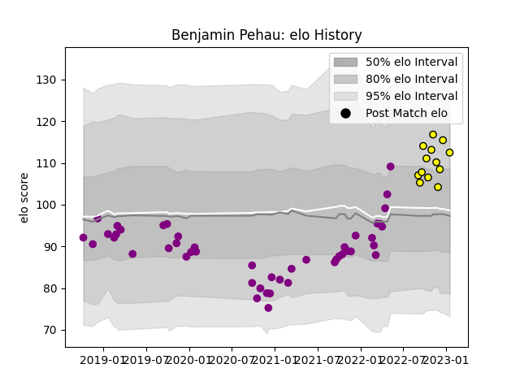

---  
layout: page  
title: Benjamin Pehau  
date: 2023-01-17 11:29:30.549779  
categories: player  
---
# Benjamin Pehau

## Positions: C, FH

## Current elo: 113.0

## Current Percentile: 84.0

# Elo History

# Match History

| Team             |   Appearances |   Win Rate |
|:-----------------|--------------:|-----------:|
| Soyaux-Angouleme |            47 |   0.457447 |
| Albi             |            13 |   0.730769 |

| Opponent                   |   Matches |   Win Rate |
|:---------------------------|----------:|-----------:|
| Nevers                     |         5 |   0.2      |
| Blagnac                    |         4 |   0.75     |
| Chambery                   |         3 |   0.333333 |
| Dax                        |         3 |   0.666667 |
| Valence Romans Drome Rugby |         3 |   0.666667 |
| Biarritz Olympique         |         3 |   0.333333 |
| Carcassonne                |         3 |   0.5      |
| Perpignan                  |         3 |   0        |
| Montauban                  |         2 |   0.5      |
| Rennes                     |         2 |   1        |
| Aubenas                    |         2 |   1        |
| Suresnes                   |         2 |   1        |
| Vannes                     |         2 |   0        |
| Colomiers                  |         2 |   0.5      |
| US Bressane                |         2 |   0.5      |
| Brive                      |         2 |   0        |
| Bourgoin-Jallieu           |         2 |   1        |
| Beziers                    |         2 |   0.5      |
| Nice                       |         2 |   0.75     |
| Tarbes                     |         1 |   0        |
| Provence Rugby             |         1 |   1        |
| Albi                       |         1 |   1        |
| Oyonnax                    |         1 |   0        |
| Narbonne                   |         1 |   1        |
| Mont-de-Marsan             |         1 |   1        |
| Dijon                      |         1 |   0        |
| Cognac Saint Jean d'Angély |         1 |   1        |
| Carqueiranne-Hyères        |         1 |   0        |
| Aurillac                   |         1 |   1        |
| Massy                      |         1 |   0        |