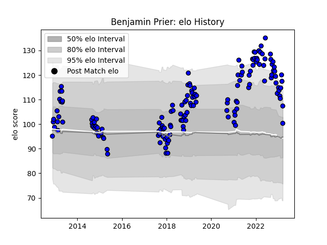

---  
layout: page  
title: Benjamin Prier  
date: 2023-03-21 18:28:08.322021  
categories: player  
---
# Benjamin Prier

Last updated: 2023-03-21
## Positions: SH

## Current elo: 100.0

## Current Percentile: 92.0

# Elo History

# Match History

| Team   |   Appearances |   Win Rate |
|:-------|--------------:|-----------:|
| Massy  |           149 |   0.392617 |

| Opponent                   |   Matches |   Win Rate |
|:---------------------------|----------:|-----------:|
| Soyaux-Angouleme           |         9 |   0.388889 |
| Aurillac                   |         8 |   0.125    |
| Albi                       |         8 |   0.375    |
| Colomiers                  |         7 |   0.285714 |
| Biarritz Olympique         |         7 |   0.285714 |
| Montauban                  |         7 |   0.142857 |
| Mont-de-Marsan             |         7 |   0.285714 |
| Carcassonne                |         7 |   0.857143 |
| Narbonne                   |         6 |   0.5      |
| Vannes                     |         5 |   0.4      |
| Nevers                     |         5 |   0.2      |
| Tarbes                     |         5 |   0.6      |
| Dax                        |         5 |   0.9      |
| Beziers                    |         5 |   0.2      |
| US Bressane                |         4 |   0.25     |
| Chambery                   |         4 |   0.625    |
| Bourgoin-Jallieu           |         4 |   0.75     |
| Bayonne                    |         4 |   0        |
| Nice                       |         4 |   0.25     |
| Provence Rugby             |         4 |   0.5      |
| Cognac Saint Jean d'Angély |         3 |   1        |
| Grenoble                   |         3 |   0.333333 |
| Brive                      |         3 |   0.333333 |
| Blagnac                    |         3 |   0.333333 |
| Pau                        |         3 |   0.333333 |
| Perpignan                  |         3 |   0.333333 |
| Rouen                      |         2 |   0        |
| Valence Romans Drome Rugby |         2 |   1        |
| Agen                       |         2 |   0        |
| Oyonnax                    |         2 |   0        |
| Dijon                      |         2 |   0.5      |
| Aubenas                    |         2 |   1        |
| La Rochelle                |         2 |   0        |
| Suresnes                   |         1 |   1        |
| Lyon                       |         1 |   0        |