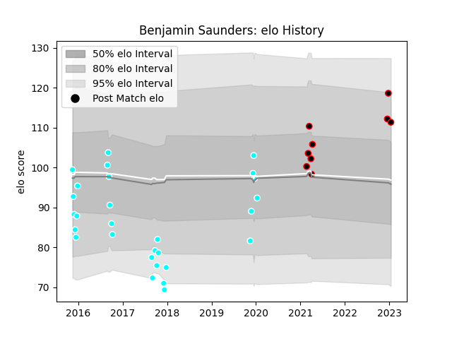

---  
layout: page  
title: Benjamin Saunders  
date: 2022-12-28 12:53:35.305211  
categories: player  
---
# Benjamin Saunders

## Positions: C, W

## Current elo: 103.0

## Current Percentile: 66.0

# Elo History

# Match History

| Team                             |   Appearances |   Win Rate |
|:---------------------------------|--------------:|-----------:|
| Toyota Industries Shuttles Aichi |            28 |   0.357143 |
| NTT Docomo Red Hurricanes Osaka  |             8 |   0.625    |

| Opponent                          |   Matches |   Win Rate |
|:----------------------------------|----------:|-----------:|
| Yokohama Canon Eagles             |         4 |   0.25     |
| Kobelco Kobe Steelers             |         3 |   0        |
| Toyota Verblitz                   |         3 |   0        |
| Green Rockets Tokatsu             |         3 |   0.333333 |
| Shizuoka Blue Revs                |         3 |   0        |
| Saitama Wild Knights              |         2 |   0        |
| Munakata Sanix Blues              |         2 |   0.5      |
| Black Rams Tokyo                  |         2 |   0.5      |
| Coca-Cola Red Sparks              |         2 |   1        |
| Kyuden Voltex                     |         2 |   1        |
| Kubota Spears Funabashi Tokyo-Bay |         1 |   0        |
| Kurita Water Gush                 |         1 |   1        |
| Chugoku Red Regulions             |         1 |   1        |
| Mazda Blue Zoomers                |         1 |   1        |
| Kamaishi Seawaves                 |         1 |   1        |
| NTT Docomo Red Hurricanes Osaka   |         1 |   1        |
| Hino Red Dolphins                 |         1 |   1        |
| Shimizu Blue Sharks               |         1 |   1        |
| Hanazono Kintetsu Liners          |         1 |   0        |
| Urayasu D-Rocks                   |         1 |   0        |