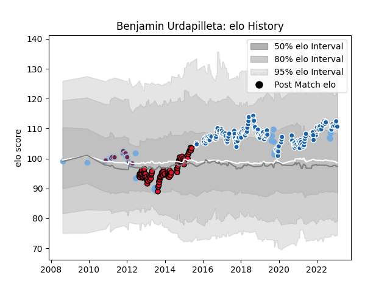

---  
layout: page  
title: Benjamin Urdapilleta  
date: 2022-12-09 13:11:28.183150  
categories: player  
---
# Benjamin Urdapilleta

## Positions: FH

## Country: Argentina

## Current elo: 126.0

## Current Percentile: 96.0

# Elo History

# Match History

| Team              |   Appearances |   Win Rate |
|:------------------|--------------:|-----------:|
| Castres Olympique |           167 |   0.58982  |
| Oyonnax           |            71 |   0.647887 |
| Harlequins        |            23 |   0.565217 |
| Argentina         |            11 |   0.181818 |

| Opponent                 |   Matches |   Win Rate |
|:-------------------------|----------:|-----------:|
| Montpellier Herault      |        20 |   0.45     |
| Stade Toulousain         |        20 |   0.55     |
| La Rochelle              |        16 |   0.5625   |
| Toulon                   |        16 |   0.375    |
| Bordeaux Begles          |        15 |   0.5      |
| Brive                    |        15 |   0.533333 |
| Lyon                     |        14 |   0.714286 |
| Pau                      |        14 |   0.785714 |
| Racing 92                |        14 |   0.571429 |
| Clermont Auvergne        |        14 |   0.642857 |
| Stade Francais Paris     |        10 |   0.4      |
| Bayonne                  |         9 |   0.722222 |
| Grenoble                 |         9 |   0.666667 |
| Agen                     |         8 |   0.75     |
| Perpignan                |         6 |   0.833333 |
| South Africa             |         4 |   0        |
| Biarritz Olympique       |         4 |   1        |
| Munster                  |         4 |   0.375    |
| Leicester Tigers         |         4 |   0.5      |
| Northampton Saints       |         3 |   0.333333 |
| Newcastle Falcons        |         3 |   0.333333 |
| Wasps                    |         3 |   1        |
| Sale Sharks              |         3 |   1        |
| Provence Rugby           |         2 |   1        |
| Oyonnax                  |         2 |   1        |
| Tarbes                   |         2 |   0.75     |
| London Irish             |         2 |   0.5      |
| Albi                     |         2 |   1        |
| Leinster                 |         2 |   0.25     |
| Aurillac                 |         2 |   0.5      |
| France                   |         2 |   0        |
| Exeter Chiefs            |         2 |   0.5      |
| England                  |         2 |   0        |
| Beziers                  |         2 |   1        |
| Dax                      |         2 |   1        |
| Carcassonne              |         2 |   0.5      |
| Cardiff Blues            |         2 |   0.5      |
| Colomiers                |         2 |   0.5      |
| Castres Olympique        |         1 |   1        |
| Auch                     |         1 |   1        |
| United States of America |         1 |   1        |
| Tonga                    |         1 |   1        |
| RC Enisei                |         1 |   1        |
| Saracens                 |         1 |   0        |
| Connacht                 |         1 |   1        |
| Massy                    |         1 |   1        |
| Dragons                  |         1 |   0        |
| Gloucester Rugby         |         1 |   1        |
| New Zealand              |         1 |   0        |
| Narbonne                 |         1 |   1        |
| Harlequins               |         1 |   0        |
| Worcester Warriors       |         1 |   1        |