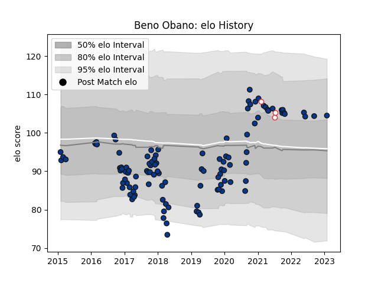

---  
layout: page  
title: Beno Obano  
date: 2023-01-30 11:44:35.621877  
categories: player  
---
# Beno Obano

## Positions: P

## Country: England

## Current elo: 105.0

## Current Percentile: 77.0

# Elo History

# Match History

| Team       |   Appearances |   Win Rate |
|:-----------|--------------:|-----------:|
| Bath Rugby |           110 |   0.445455 |
| England    |             3 |   0.666667 |

| Opponent                 |   Matches |   Win Rate |
|:-------------------------|----------:|-----------:|
| Exeter Chiefs            |        11 |  0.0909091 |
| Leicester Tigers         |        10 |  0.6       |
| Wasps                    |         9 |  0.222222  |
| Harlequins               |         9 |  0.444444  |
| Saracens                 |         8 |  0.4375    |
| Bristol Rugby            |         8 |  0.375     |
| Worcester Warriors       |         7 |  0.714286  |
| Sale Sharks              |         7 |  0.428571  |
| Gloucester Rugby         |         7 |  0.5       |
| Newcastle Falcons        |         6 |  0.166667  |
| Northampton Saints       |         6 |  0.833333  |
| London Irish             |         6 |  0.833333  |
| Scarlets                 |         3 |  0.333333  |
| Cardiff Blues            |         2 |  0.5       |
| Toulon                   |         2 |  0.5       |
| Ulster                   |         2 |  0         |
| London Welsh             |         1 |  1         |
| Clermont Auvergne        |         1 |  0         |
| Ospreys                  |         1 |  0         |
| Pau                      |         1 |  1         |
| Canada                   |         1 |  1         |
| Scotland                 |         1 |  0         |
| Stade Francais Paris     |         1 |  0         |
| United States of America |         1 |  1         |
| Brive                    |         1 |  1         |
| Benetton Treviso         |         1 |  1         |