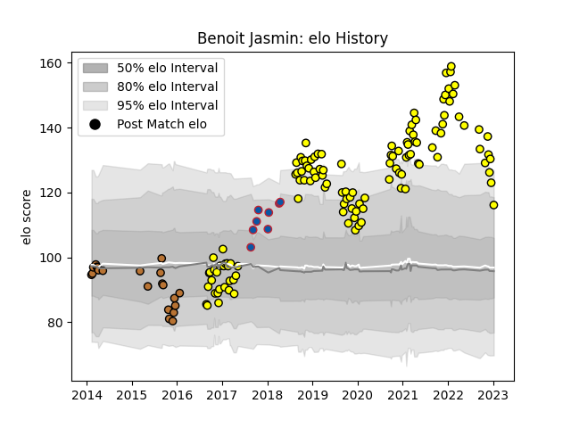

---  
layout: page  
title: Benoit Jasmin  
date: 2022-12-14 11:36:45.320481  
categories: player  
---
# Benoit Jasmin

## Positions: W, FB

## Current elo: 122.0

## Current Percentile: 95.0

# Elo History

# Match History

| Team        |   Appearances |   Win Rate |
|:------------|--------------:|-----------:|
| Carcassonne |           111 |   0.603604 |
| Narbonne    |             9 |   0.333333 |
| Grenoble    |             7 |   0.714286 |

| Opponent                   |   Matches |   Win Rate |
|:---------------------------|----------:|-----------:|
| Beziers                    |        10 |   0.6      |
| Montauban                  |         9 |   0.555556 |
| Mont-de-Marsan             |         8 |   0.375    |
| Vannes                     |         8 |   0.625    |
| Aurillac                   |         8 |   0.625    |
| Colomiers                  |         7 |   0.714286 |
| Provence Rugby             |         7 |   0.571429 |
| Nevers                     |         6 |   1        |
| Rouen                      |         6 |   0.833333 |
| Biarritz Olympique         |         6 |   0.666667 |
| Oyonnax                    |         6 |   0.333333 |
| Perpignan                  |         5 |   0.4      |
| Soyaux-Angouleme           |         5 |   0.7      |
| Narbonne                   |         5 |   0.8      |
| Dax                        |         4 |   0.5      |
| Grenoble                   |         4 |   0.5      |
| US Bressane                |         3 |   1        |
| Bayonne                    |         3 |   0.333333 |
| Albi                       |         3 |   0.166667 |
| Bourgoin-Jallieu           |         3 |   1        |
| Agen                       |         3 |   0.333333 |
| Massy                      |         2 |   0.5      |
| Brive                      |         2 |   0.5      |
| Valence Romans Drome Rugby |         2 |   0        |
| Roval Drome XV             |         1 |   1        |
| Tarbes                     |         1 |   0        |