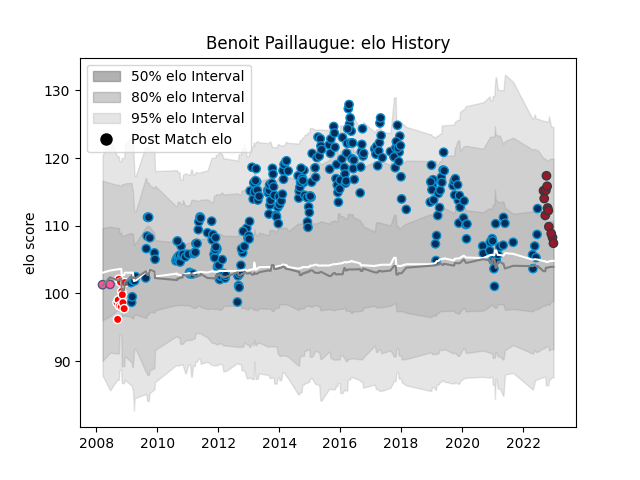

---  
layout: page  
title: Benoit Paillaugue  
date: 2023-01-06 00:20:25.067630  
categories: player  
---
# Benoit Paillaugue

## Positions: SH, FH

## Current elo: 107.0

## Current Percentile: 72.0

# Elo History

# Match History

| Team                 |   Appearances |   Win Rate |
|:---------------------|--------------:|-----------:|
| Montpellier Herault  |           276 |   0.54529  |
| Auch                 |            12 |   0.5      |
| Toulon               |            12 |   0.416667 |
| Stade Francais Paris |             2 |   0        |

| Opponent             |   Matches |   Win Rate |
|:---------------------|----------:|-----------:|
| Stade Toulousain     |        23 |   0.434783 |
| Castres Olympique    |        22 |   0.454545 |
| Clermont Auvergne    |        21 |   0.571429 |
| Racing 92            |        20 |   0.425    |
| Toulon               |        19 |   0.5      |
| Stade Francais Paris |        17 |   0.647059 |
| Bayonne              |        16 |   0.6875   |
| Bordeaux Begles      |        16 |   0.71875  |
| Brive                |        15 |   0.4      |
| La Rochelle          |        14 |   0.25     |
| Perpignan            |        13 |   0.423077 |
| Agen                 |        12 |   0.666667 |
| Lyon                 |        11 |   0.363636 |
| Pau                  |        10 |   0.6      |
| Grenoble             |        10 |   0.9      |
| Biarritz Olympique   |         8 |   0.625    |
| Oyonnax              |         7 |   0.714286 |
| Glasgow Warriors     |         6 |   0.416667 |
| Bourgoin-Jallieu     |         4 |   0.75     |
| Bath Rugby           |         4 |   0.25     |
| Sale Sharks          |         3 |   1        |
| Leinster             |         3 |   0.166667 |
| Harlequins           |         3 |   0.666667 |
| Connacht             |         2 |   0.5      |
| Cardiff Blues        |         2 |   0.5      |
| Exeter Chiefs        |         2 |   0.5      |
| Mont-de-Marsan       |         2 |   1        |
| Newcastle Falcons    |         2 |   1        |
| Ulster               |         1 |   0        |
| US Bressane          |         1 |   1        |
| Benetton Treviso     |         1 |   1        |
| Tarbes               |         1 |   0        |
| Beziers              |         1 |   0        |
| Calvisano            |         1 |   1        |
| Leicester Tigers     |         1 |   0        |
| Colomiers            |         1 |   0        |
| Gloucester Rugby     |         1 |   1        |
| Dragons              |         1 |   1        |
| Edinburgh            |         1 |   0        |
| Narbonne             |         1 |   1        |
| Montpellier Herault  |         1 |   0        |
| Montauban            |         1 |   0        |
| Zebre                |         1 |   1        |