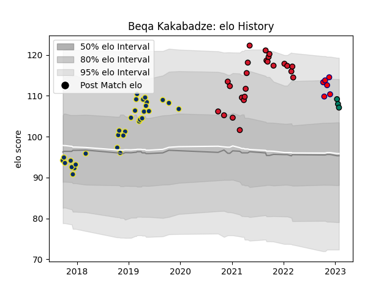

---  
layout: page  
title: Beqa Kakabadze  
date: 2023-02-02 18:47:48.095469  
categories: player  
---
# Beqa Kakabadze

## Positions: P

## Current elo: 107.0

## Current Percentile: 86.0

# Elo History

# Match History

| Team                       |   Appearances |   Win Rate |
|:---------------------------|--------------:|-----------:|
| Clermont Auvergne          |            32 |   0.703125 |
| Oyonnax                    |            24 |   0.541667 |
| Cognac Saint Jean d'Angély |             6 |   0        |
| Suresnes                   |             3 |   0        |

| Opponent                   |   Matches |   Win Rate |
|:---------------------------|----------:|-----------:|
| Grenoble                   |         6 |   0.583333 |
| Rouen                      |         4 |   0.5      |
| Lyon                       |         3 |   0.666667 |
| Colomiers                  |         3 |   0        |
| Agen                       |         2 |   1        |
| Timisoara Saracens         |         2 |   1        |
| Stade Toulousain           |         2 |   0        |
| Racing 92                  |         2 |   0.75     |
| Perpignan                  |         2 |   0.5      |
| Pau                        |         2 |   0.5      |
| Northampton Saints         |         2 |   1        |
| Nice                       |         2 |   0        |
| Nevers                     |         2 |   0.5      |
| Narbonne                   |         2 |   0        |
| Bayonne                    |         2 |   0.5      |
| Vannes                     |         2 |   1        |
| La Rochelle                |         2 |   1        |
| Bordeaux Begles            |         2 |   0.5      |
| Castres Olympique          |         2 |   0.5      |
| Valence Romans Drome Rugby |         1 |   1        |
| Toulon                     |         1 |   0        |
| Beziers                    |         1 |   1        |
| Biarritz Olympique         |         1 |   1        |
| Stade Francais Paris       |         1 |   1        |
| Saracens                   |         1 |   1        |
| Blagnac                    |         1 |   0        |
| Rennes                     |         1 |   0        |
| Provence Rugby             |         1 |   1        |
| Mont-de-Marsan             |         1 |   1        |
| Bourgoin-Jallieu           |         1 |   0        |
| Carcassonne                |         1 |   1        |
| Oyonnax                    |         1 |   0.5      |
| Carqueiranne-Hyères        |         1 |   0        |
| Dax                        |         1 |   0        |
| Dragons                    |         1 |   1        |
| Harlequins                 |         1 |   1        |
| Montauban                  |         1 |   0        |
| Montpellier Herault        |         1 |   0        |