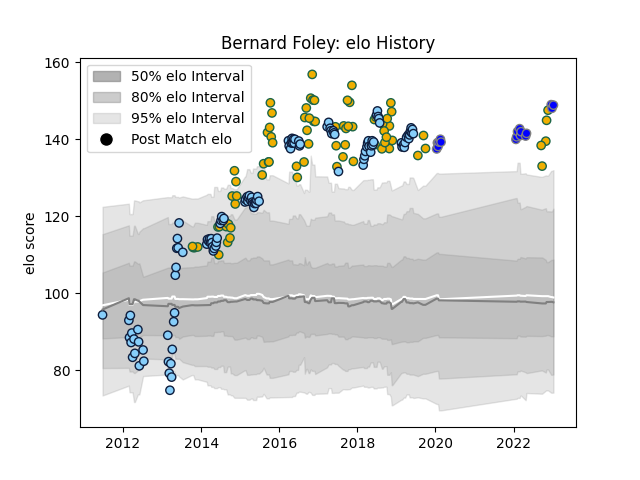

---  
layout: page  
title: Bernard Foley  
date: 2022-11-22 11:32:38.119969  
categories: player  
---
# Bernard Foley

## Positions: FH

## Country: Australia

## Current elo: 140.0

## Current Percentile: 99.0

# Elo History

# Match History

| Team                              |   Appearances |   Win Rate |
|:----------------------------------|--------------:|-----------:|
| New South Wales Waratahs          |           118 |   0.538136 |
| Australia                         |            74 |   0.47973  |
| Kubota Spears Funabashi Tokyo-Bay |            13 |   0.769231 |

| Opponent                 |   Matches |   Win Rate |
|:-------------------------|----------:|-----------:|
| New Zealand              |        16 |   0.15625  |
| Melbourne Rebels         |        15 |   0.866667 |
| Queensland Reds          |        14 |   0.714286 |
| Brumbies                 |        13 |   0.461538 |
| Argentina                |        11 |   0.818182 |
| South Africa             |         9 |   0.444444 |
| Western Force            |         9 |   0.555556 |
| England                  |         8 |   0.125    |
| Blues                    |         8 |   0.25     |
| Highlanders              |         7 |   0.428571 |
| Hurricanes               |         7 |   0.285714 |
| Chiefs                   |         6 |   0.5      |
| Crusaders                |         6 |   0.5      |
| France                   |         6 |   0.666667 |
| Wales                    |         6 |   0.666667 |
| Ireland                  |         6 |   0.166667 |
| Stormers                 |         6 |   0.666667 |
| Sharks                   |         5 |   0.5      |
| Scotland                 |         5 |   0.6      |
| Lions                    |         5 |   0.2      |
| Sunwolves                |         4 |   1        |
| Cheetahs                 |         4 |   0.5      |
| Bulls                    |         4 |   0.5      |
| Jaguares                 |         3 |   0        |
| Kobelco Kobe Steelers    |         2 |   0.5      |
| Toyota Verblitz          |         2 |   0.5      |
| Urayasu D-Rocks          |         2 |   1        |
| Italy                    |         2 |   1        |
| Fiji                     |         2 |   1        |
| Southern Kings           |         2 |   0.5      |
| Uruguay                  |         1 |   1        |
| United States of America |         1 |   1        |
| Mie Honda Heat           |         1 |   1        |
| Tokyo Sungoliath         |         1 |   0        |
| Shizuoka Blue Revs       |         1 |   1        |
| Samoa                    |         1 |   1        |
| Munakata Sanix Blues     |         1 |   1        |
| Hino Red Dolphins        |         1 |   1        |
| Green Rockets Tokatsu    |         1 |   1        |
| Yokohama Canon Eagles    |         1 |   1        |