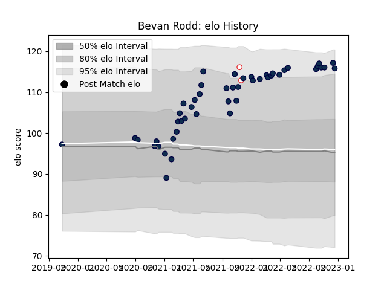

---  
layout: page  
title: Bevan Rodd  
date: 2023-03-17 17:16:10.701863  
categories: player  
---
# Bevan Rodd

## Positions: P

## Country: England

## Current elo: 112.0

## Current Percentile: 90.0

# Elo History

# Match History

| Team        |   Appearances |   Win Rate |
|:------------|--------------:|-----------:|
| Sale Sharks |            64 |   0.609375 |
| England     |             2 |   1        |

| Opponent           |   Matches |   Win Rate |
|:-------------------|----------:|-----------:|
| Bristol Rugby      |         7 |   0.714286 |
| London Irish       |         6 |   0.75     |
| Exeter Chiefs      |         6 |   0.333333 |
| Harlequins         |         6 |   0.666667 |
| Saracens           |         4 |   0.5      |
| Northampton Saints |         4 |   0.5      |
| Leicester Tigers   |         4 |   0.75     |
| Newcastle Falcons  |         3 |   0.666667 |
| Wasps              |         3 |   1        |
| Bath Rugby         |         3 |   0.833333 |
| Worcester Warriors |         3 |   0.666667 |
| Gloucester Rugby   |         3 |   1        |
| Ospreys            |         2 |   1        |
| Stade Toulousain   |         2 |   0        |
| Ulster             |         2 |   0.5      |
| La Rochelle        |         1 |   0        |
| Racing 92          |         1 |   0        |
| Edinburgh          |         1 |   0        |
| Scarlets           |         1 |   1        |
| South Africa       |         1 |   1        |
| Toulon             |         1 |   0        |
| Clermont Auvergne  |         1 |   0        |
| Australia          |         1 |   1        |