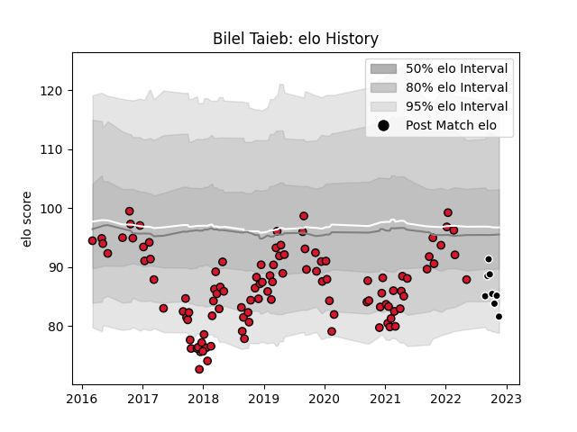

---  
layout: page  
title: Bilel Taieb  
date: 2022-12-18 16:17:54.894885  
categories: player  
---
# Bilel Taieb

## Positions: FL

## Current elo: 81.0

## Current Percentile: 8.0

# Elo History

# Match History

| Team           |   Appearances |   Win Rate |
|:---------------|--------------:|-----------:|
| Oyonnax        |           108 |   0.472222 |
| Provence Rugby |            10 |   0.55     |

| Opponent                   |   Matches |   Win Rate |
|:---------------------------|----------:|-----------:|
| Montauban                  |         8 |   0.4375   |
| Carcassonne                |         8 |   0.75     |
| Aurillac                   |         6 |   0.5      |
| Vannes                     |         6 |   0.333333 |
| Provence Rugby             |         6 |   0.666667 |
| Nevers                     |         6 |   0.666667 |
| Beziers                    |         5 |   0.6      |
| Rouen                      |         5 |   0.4      |
| Brive                      |         5 |   0.2      |
| Mont-de-Marsan             |         5 |   0.7      |
| Colomiers                  |         4 |   0.25     |
| Grenoble                   |         4 |   0.25     |
| Massy                      |         3 |   0.666667 |
| Soyaux-Angouleme           |         3 |   1        |
| Perpignan                  |         3 |   0.333333 |
| Agen                       |         3 |   0        |
| La Rochelle                |         3 |   0.5      |
| Biarritz Olympique         |         3 |   0.333333 |
| Bordeaux Begles            |         3 |   0.333333 |
| Racing 92                  |         2 |   0        |
| Bayonne                    |         2 |   0.5      |
| Valence Romans Drome Rugby |         2 |   1        |
| US Bressane                |         2 |   0.5      |
| Toulon                     |         2 |   0.5      |
| Stade Francais Paris       |         2 |   0.5      |
| Worcester Warriors         |         2 |   0.5      |
| Clermont Auvergne          |         2 |   0.75     |
| Pau                        |         2 |   0        |
| Connacht                   |         2 |   0        |
| Montpellier Herault        |         2 |   0        |
| Castres Olympique          |         1 |   0        |
| Roval Drome XV             |         1 |   1        |
| Oyonnax                    |         1 |   0.5      |
| Stade Toulousain           |         1 |   0        |
| Narbonne                   |         1 |   1        |
| Albi                       |         1 |   1        |
| Lyon                       |         1 |   1        |