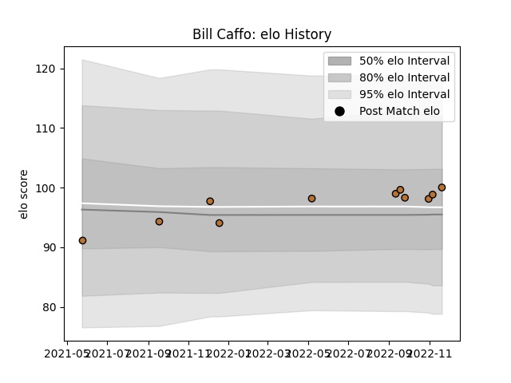

---  
layout: page  
title: Bill Caffo  
date: 2022-11-22 11:41:00.044384  
categories: player  
---
# Bill Caffo

## Positions: FL

## Current elo: 100.0

## Current Percentile: 61.0

# Elo History

# Match History

| Team     |   Appearances |   Win Rate |
|:---------|--------------:|-----------:|
| Narbonne |            11 |   0.363636 |

| Opponent                   |   Matches |   Win Rate |
|:---------------------------|----------:|-----------:|
| Albi                       |         1 |        0   |
| Blagnac                    |         1 |        0.5 |
| Bourgoin-Jallieu           |         1 |        0   |
| Chambery                   |         1 |        0   |
| Cognac Saint Jean d'Angély |         1 |        1   |
| Montauban                  |         1 |        0   |
| Oyonnax                    |         1 |        0   |
| Provence Rugby             |         1 |        1   |
| Suresnes                   |         1 |        1   |
| US Bressane                |         1 |        0   |
| Vannes                     |         1 |        0.5 |