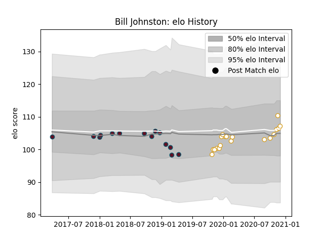

---  
layout: page  
title: Bill Johnston  
date: 2023-01-06 00:14:20.826519  
categories: player  
---
# Bill Johnston

## Positions: FH

## Current elo: 107.0

## Current Percentile: 55.0

# Elo History

# Match History

| Team    |   Appearances |   Win Rate |
|:--------|--------------:|-----------:|
| Ulster  |            19 |   0.736842 |
| Munster |            14 |   0.607143 |

| Opponent          |   Matches |   Win Rate |
|:------------------|----------:|-----------:|
| Zebre             |         5 |   1        |
| Ulster            |         3 |   0.166667 |
| Benetton Treviso  |         2 |   1        |
| Cardiff Blues     |         2 |   0.5      |
| Cheetahs          |         2 |   1        |
| Clermont Auvergne |         2 |   0.5      |
| Connacht          |         2 |   1        |
| Dragons           |         2 |   1        |
| Edinburgh         |         2 |   0.5      |
| Harlequins        |         2 |   1        |
| Leinster          |         2 |   0        |
| Ospreys           |         2 |   0.5      |
| Scarlets          |         2 |   0.5      |
| Bath Rugby        |         1 |   1        |
| Glasgow Warriors  |         1 |   1        |
| Munster           |         1 |   0        |