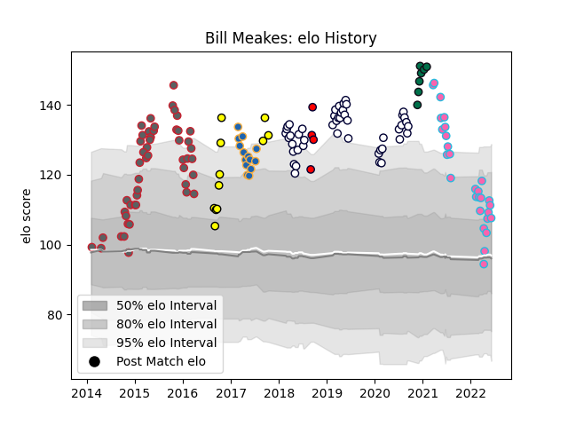

---  
layout: page  
title: Bill Meakes  
date: 2023-03-21 18:46:48.064877  
categories: player  
---
# Bill Meakes

Last updated: 2023-03-21
## Positions: C

## Current elo: 108.0

## Current Percentile: 81.0

# Elo History

# Match History

| Team             |   Appearances |   Win Rate |
|:-----------------|--------------:|-----------:|
| Gloucester Rugby |            49 |   0.622449 |
| Melbourne Rebels |            47 |   0.457447 |
| L. A. Giltinis   |            28 |   0.75     |
| Western Force    |            14 |   0.428571 |
| Perth Spirit     |            11 |   0.818182 |
| London Irish     |             7 |   0.642857 |
| Melbourne Rising |             4 |   0.25     |

| Opponent                 |   Matches |   Win Rate |
|:-------------------------|----------:|-----------:|
| Queensland Reds          |         9 |   0.611111 |
| New South Wales Waratahs |         9 |   0.333333 |
| Brumbies                 |         8 |   0.625    |
| Harlequins               |         5 |   0.5      |
| Exeter Chiefs            |         5 |   0.4      |
| Sunwolves                |         5 |   0.8      |
| Newcastle Falcons        |         5 |   0.8      |
| London Irish             |         4 |   0.75     |
| Seattle Seawolves        |         4 |   0.75     |
| Sharks                   |         4 |   0.25     |
| Utah Warriors            |         4 |   0.75     |
| Wasps                    |         4 |   0.5      |
| Austin Gilgronis         |         4 |   0.75     |
| Highlanders              |         4 |   0.5      |
| Lions                    |         3 |   0.333333 |
| Leicester Tigers         |         3 |   0.333333 |
| Hurricanes               |         3 |   0        |
| Houston SaberCats        |         3 |   0.666667 |
| NSW Country Eagles       |         3 |   0.666667 |
| Rugby ATL                |         3 |   0.666667 |
| Sale Sharks              |         3 |   0.333333 |
| San Diego Legion         |         3 |   0.666667 |
| Saracens                 |         3 |   0.333333 |
| Worcester Warriors       |         3 |   0.333333 |
| Queensland Country       |         2 |   0.5      |
| New England Free Jacks   |         2 |   1        |
| Oyonnax                  |         2 |   1        |
| Northampton Saints       |         2 |   0.25     |
| North Harbour Rays       |         2 |   0.5      |
| Stormers                 |         2 |   0        |
| Western Force            |         2 |   1        |
| Melbourne Rising         |         2 |   1        |
| Zebre                    |         2 |   1        |
| Crusaders                |         2 |   0        |
| London Welsh             |         2 |   1        |
| Bath Rugby               |         2 |   0.5      |
| Blues                    |         2 |   0.5      |
| Jaguares                 |         2 |   0.5      |
| Greater Sydney Rams      |         2 |   1        |
| Brisbane City            |         2 |   0.5      |
| Edinburgh                |         2 |   1        |
| Brive                    |         2 |   1        |
| Bulls                    |         2 |   0        |
| Connacht                 |         2 |   1        |
| Chiefs                   |         2 |   0        |
| Canberra Vikings         |         1 |   1        |
| Bordeaux Begles          |         1 |   0        |
| Toronto Arrows           |         1 |   1        |
| Southern Kings           |         1 |   1        |
| NOLA Gold                |         1 |   0        |
| Melbourne Rebels         |         1 |   1        |
| Dallas Jackals           |         1 |   1        |
| Rugby New York           |         1 |   1        |
| R.U. New York            |         1 |   1        |
| Fijian Drua              |         1 |   0        |
| Pau                      |         1 |   1        |
| Ospreys                  |         1 |   1        |
| La Rochelle              |         1 |   1        |
| Agen                     |         1 |   1        |