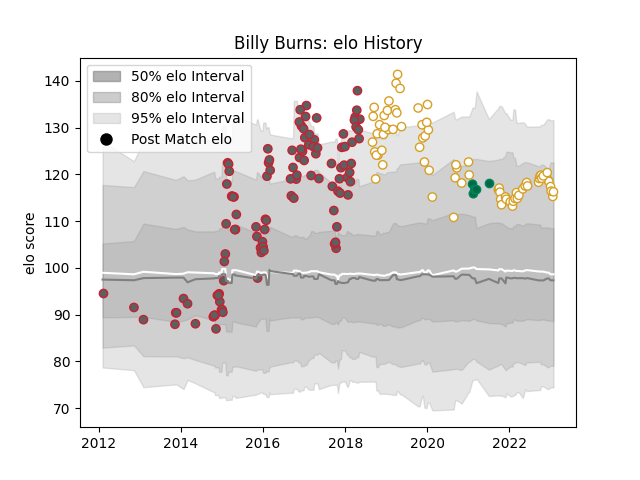

---  
layout: page  
title: Billy Burns  
date: 2023-02-02 18:49:55.514979  
categories: player  
---
# Billy Burns

## Positions: FH

## Country: Ireland

## Current elo: 116.0

## Current Percentile: 84.0

# Elo History

# Match History

| Team             |   Appearances |   Win Rate |
|:-----------------|--------------:|-----------:|
| Gloucester Rugby |           107 |   0.579439 |
| Ulster           |            73 |   0.657534 |
| Ireland          |             5 |   0.6      |

| Opponent             |   Matches |   Win Rate |
|:---------------------|----------:|-----------:|
| Harlequins           |        11 |   0.5      |
| Connacht             |         9 |   0.666667 |
| Worcester Warriors   |         8 |   0.6875   |
| Newcastle Falcons    |         8 |   0.625    |
| Munster              |         8 |   0.625    |
| Bath Rugby           |         8 |   0.5      |
| London Irish         |         7 |   0.857143 |
| Wasps                |         7 |   0.357143 |
| Scarlets             |         7 |   0.714286 |
| Sale Sharks          |         7 |   0.571429 |
| Northampton Saints   |         7 |   0.214286 |
| Leinster             |         7 |   0.285714 |
| Leicester Tigers     |         7 |   0.428571 |
| Saracens             |         6 |   0.5      |
| Ospreys              |         6 |   0.5      |
| Zebre                |         6 |   1        |
| Exeter Chiefs        |         6 |   0.5      |
| Cardiff Blues        |         6 |   0.833333 |
| Benetton Treviso     |         6 |   0.75     |
| La Rochelle          |         5 |   0.6      |
| Edinburgh            |         5 |   1        |
| Southern Kings       |         3 |   1        |
| Glasgow Warriors     |         3 |   0.333333 |
| Stormers             |         3 |   0.333333 |
| Oyonnax              |         2 |   1        |
| Bristol Rugby        |         2 |   1        |
| Brive                |         2 |   1        |
| Pau                  |         2 |   0        |
| Racing 92            |         2 |   0.5      |
| Dragons              |         2 |   1        |
| London Welsh         |         2 |   1        |
| Lions                |         2 |   1        |
| Clermont Auvergne    |         2 |   0.5      |
| Stade Francais Paris |         1 |   0        |
| Wales                |         1 |   0        |
| Bayonne              |         1 |   1        |
| Stade Toulousain     |         1 |   0        |
| Italy                |         1 |   1        |
| Sharks               |         1 |   1        |
| Scotland             |         1 |   1        |
| Japan                |         1 |   1        |
| Cheetahs             |         1 |   0.5      |
| France               |         1 |   0        |
| Agen                 |         1 |   1        |