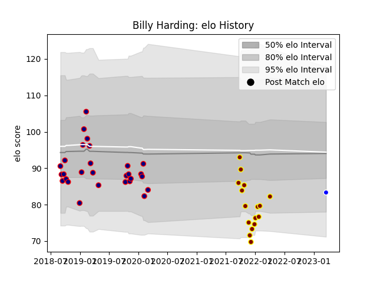

---  
layout: page  
title: Billy Harding  
date: 2023-03-21 18:08:23.429917  
categories: player  
---
# Billy Harding

Last updated: 2023-03-21
## Positions: H

## Current elo: 84.0

## Current Percentile: None

# Elo History

# Match History

| Team            |   Appearances |   Win Rate |
|:----------------|--------------:|-----------:|
| London Scottish |            28 |      0.375 |
| Ampthill        |            16 |      0.375 |
| Coventry        |             1 |      1     |

| Opponent            |   Matches |   Win Rate |
|:--------------------|----------:|-----------:|
| Nottingham          |         5 |   0.2      |
| Bedford             |         4 |   0.5      |
| Cornish Pirates     |         4 |   0.375    |
| Coventry            |         4 |   0.5      |
| Ealing Trailfinders |         4 |   0        |
| Jersey              |         4 |   0.625    |
| Yorkshire Carnegie  |         4 |   0.75     |
| Doncaster           |         3 |   0        |
| Hartpury College    |         3 |   0.333333 |
| Richmond            |         3 |   0.333333 |
| London Irish        |         2 |   0        |
| London Scottish     |         2 |   1        |
| Ampthill            |         1 |   0.5      |
| Caldy               |         1 |   1        |
| Newcastle Falcons   |         1 |   0        |