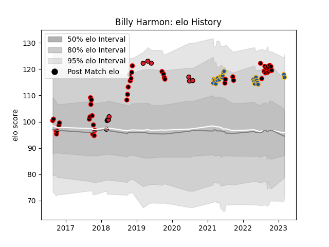

---  
layout: page  
title: Billy Harmon  
date: 2023-03-17 17:30:15.438688  
categories: player  
---
# Billy Harmon

## Positions: FL

## Country: New Zealand Maori

## Current elo: 117.0

## Current Percentile: 91.0

# Elo History

# Match History

| Team              |   Appearances |   Win Rate |
|:------------------|--------------:|-----------:|
| Canterbury        |            40 |   0.825    |
| Highlanders       |            24 |   0.458333 |
| Crusaders         |            11 |   0.727273 |
| New Zealand Maori |             7 |   0.857143 |

| Opponent                 |   Matches |   Win Rate |
|:-------------------------|----------:|-----------:|
| Chiefs                   |         7 |   0.714286 |
| Blues                    |         5 |   0.2      |
| Tasman                   |         5 |   1        |
| Hurricanes               |         5 |   0.2      |
| Auckland                 |         4 |   0.75     |
| Wellington               |         4 |   0.25     |
| Otago                    |         4 |   1        |
| Taranaki                 |         4 |   0.5      |
| Hawke's Bay              |         3 |   1        |
| Crusaders                |         3 |   0.333333 |
| Counties Manukau         |         3 |   1        |
| Waikato                  |         3 |   1        |
| North Harbour            |         3 |   1        |
| Southland                |         2 |   1        |
| New South Wales Waratahs |         2 |   0.5      |
| Samoa                    |         2 |   1        |
| Queensland Reds          |         2 |   1        |
| Northland                |         2 |   1        |
| Manawatu                 |         2 |   0.5      |
| Melbourne Rebels         |         2 |   0.5      |
| Ireland                  |         2 |   0.5      |
| Brumbies                 |         2 |   0.5      |
| Western Force            |         2 |   1        |
| Bay of Plenty            |         1 |   1        |
| Lions                    |         1 |   1        |
| Highlanders              |         1 |   0        |
| Fijian Drua              |         1 |   1        |
| Stormers                 |         1 |   1        |
| Chile                    |         1 |   1        |
| Bulls                    |         1 |   1        |
| United States of America |         1 |   1        |
| Brazil                   |         1 |   1        |