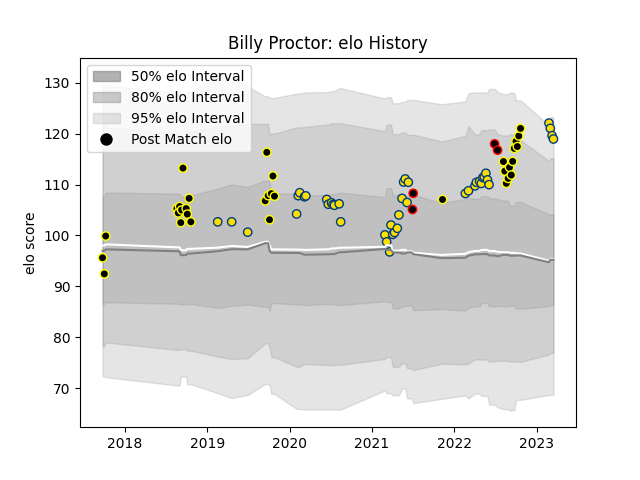

---  
layout: page  
title: Billy Proctor  
date: 2023-03-21 18:23:58.935539  
categories: player  
---
# Billy Proctor

Last updated: 2023-03-21
## Positions: C

## Country: New Zealand Maori

## Current elo: 119.0

## Current Percentile: 92.0

# Elo History

# Match History

| Team              |   Appearances |   Win Rate |
|:------------------|--------------:|-----------:|
| Hurricanes        |            43 |   0.534884 |
| Wellington        |            33 |   0.69697  |
| New Zealand Maori |             4 |   0.75     |

| Opponent                 |   Matches |   Win Rate |
|:-------------------------|----------:|-----------:|
| Crusaders                |         6 |   0        |
| Blues                    |         6 |   0.166667 |
| Chiefs                   |         6 |   0.5      |
| Highlanders              |         5 |   0.8      |
| Auckland                 |         4 |   0.5      |
| Waikato                  |         4 |   0.75     |
| Otago                    |         4 |   1        |
| New South Wales Waratahs |         4 |   1        |
| Canterbury               |         4 |   0.5      |
| Queensland Reds          |         3 |   1        |
| Brumbies                 |         3 |   0        |
| Tasman                   |         3 |   0        |
| Melbourne Rebels         |         3 |   1        |
| Southland                |         3 |   1        |
| Taranaki                 |         2 |   1        |
| Samoa                    |         2 |   1        |
| Hawke's Bay              |         2 |   1        |
| Western Force            |         2 |   0.5      |
| Northland                |         2 |   0.5      |
| North Harbour            |         2 |   0.5      |
| Ireland                  |         2 |   0.5      |
| Counties Manukau         |         2 |   1        |
| Sharks                   |         1 |   1        |
| Bay of Plenty            |         1 |   1        |
| Stormers                 |         1 |   0        |
| Sunwolves                |         1 |   1        |
| Jaguares                 |         1 |   1        |
| Fijian Drua              |         1 |   1        |