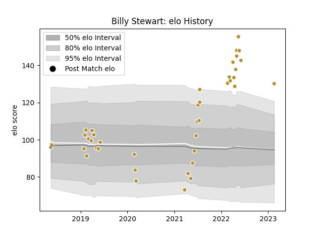

---  
layout: page  
title: Billy Stewart  
date: 2023-03-21 18:43:17.501740  
categories: player  
---
# Billy Stewart

Last updated: 2023-03-21
## Positions: L

## Current elo: 133.0

## Current Percentile: 94.0

# Elo History

# Match History

| Team      |   Appearances |   Win Rate |
|:----------|--------------:|-----------:|
| NOLA Gold |            45 |   0.522222 |

| Opponent               |   Matches |   Win Rate |
|:-----------------------|----------:|-----------:|
| New England Free Jacks |         6 |   0.5      |
| Houston SaberCats      |         4 |   0.5      |
| Rugby ATL              |         4 |   0        |
| Seattle Seawolves      |         4 |   0.5      |
| Toronto Arrows         |         4 |   0.5      |
| Utah Warriors          |         4 |   1        |
| R.U. New York          |         3 |   0.333333 |
| Rugby New York         |         3 |   0.666667 |
| San Diego Legion       |         3 |   0        |
| Austin Elite Rugby     |         2 |   1        |
| Glendale Raptors       |         2 |   0.5      |
| Old Glory DC           |         2 |   0.75     |
| Austin Gilgronis       |         1 |   0        |
| Colorado Raptors       |         1 |   1        |
| Dallas Jackals         |         1 |   1        |
| L. A. Giltinis         |         1 |   1        |