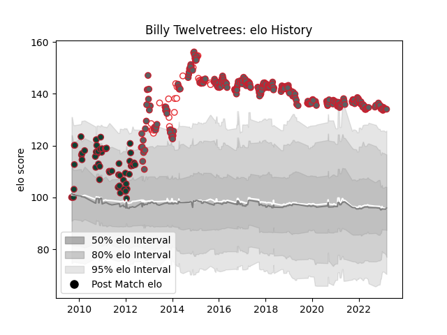

---  
layout: page  
title: Billy Twelvetrees  
date: 2022-11-22 11:43:05.619920  
categories: player  
---
# Billy Twelvetrees

## Positions: C, FH

## Country: England

## Current elo: 113.0

## Current Percentile: 90.0

# Elo History

# Match History

| Team             |   Appearances |   Win Rate |
|:-----------------|--------------:|-----------:|
| Gloucester Rugby |           250 |   0.528    |
| Leicester Tigers |            58 |   0.681034 |
| England          |            21 |   0.761905 |

| Opponent             |   Matches |   Win Rate |
|:---------------------|----------:|-----------:|
| Exeter Chiefs        |        24 |   0.4375   |
| Saracens             |        24 |   0.333333 |
| Harlequins           |        24 |   0.3125   |
| Sale Sharks          |        23 |   0.521739 |
| Wasps                |        22 |   0.522727 |
| Bath Rugby           |        21 |   0.547619 |
| Northampton Saints   |        21 |   0.452381 |
| Newcastle Falcons    |        20 |   0.75     |
| London Irish         |        20 |   0.725    |
| Worcester Warriors   |        19 |   0.789474 |
| Leicester Tigers     |        16 |   0.3125   |
| Bristol Rugby        |        10 |   0.4      |
| London Welsh         |         4 |   1        |
| Gloucester Rugby     |         4 |   0.625    |
| Zebre                |         4 |   1        |
| Connacht             |         4 |   0.75     |
| Edinburgh            |         3 |   0.666667 |
| Munster              |         3 |   0        |
| Yorkshire Carnegie   |         3 |   1        |
| Wales                |         3 |   0.666667 |
| Scotland             |         3 |   1        |
| Perpignan            |         3 |   0.833333 |
| Benetton Treviso     |         3 |   1        |
| Ireland              |         3 |   0.666667 |
| France               |         3 |   0.666667 |
| La Rochelle          |         3 |   1        |
| Italy                |         3 |   1        |
| Oyonnax              |         2 |   1        |
| Argentina            |         2 |   1        |
| Clermont Auvergne    |         2 |   0.5      |
| Stade Toulousain     |         2 |   0        |
| Australia            |         2 |   1        |
| Bayonne              |         2 |   1        |
| Pau                  |         2 |   0        |
| Leeds                |         2 |   1        |
| New Zealand          |         2 |   0        |
| Montpellier Herault  |         2 |   0.5      |
| Mont-de-Marsan       |         2 |   1        |
| Brive                |         2 |   1        |
| Cardiff Blues        |         2 |   0.5      |
| Agen                 |         2 |   1        |
| Ospreys              |         1 |   0.5      |
| Aironi               |         1 |   1        |
| Bordeaux Begles      |         1 |   1        |
| Scarlets             |         1 |   1        |
| Castres Olympique    |         1 |   1        |
| Stade Francais Paris |         1 |   0        |
| Ulster               |         1 |   0        |
| Arix Viadana         |         1 |   1        |