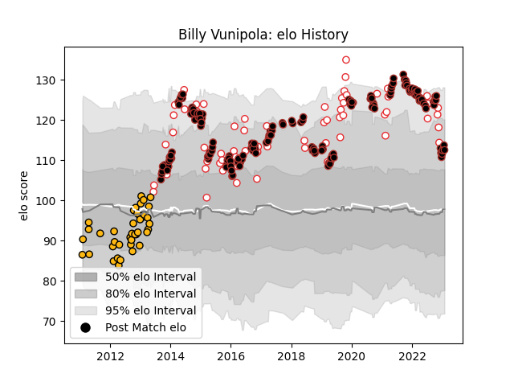

---  
layout: page  
title: Billy Vunipola  
date: 2022-11-15 23:45:41.363237  
categories: player  
---
# Billy Vunipola

## Positions: N8

## Country: England

## Current elo: 137.0

## Current Percentile: 98.0

# Elo History

# Match History

| Team     |   Appearances |   Win Rate |
|:---------|--------------:|-----------:|
| Saracens |           154 |   0.824675 |
| England  |            58 |   0.663793 |
| Wasps    |            39 |   0.410256 |

| Opponent                 |   Matches |   Win Rate |
|:-------------------------|----------:|-----------:|
| Harlequins               |        19 |   0.736842 |
| Exeter Chiefs            |        15 |   0.533333 |
| Bath Rugby               |        15 |   0.7      |
| Northampton Saints       |        14 |   0.642857 |
| Wasps                    |        10 |   0.8      |
| Leicester Tigers         |        10 |   0.7      |
| Sale Sharks              |         9 |   0.666667 |
| Gloucester Rugby         |         9 |   0.777778 |
| Newcastle Falcons        |         8 |   0.875    |
| London Irish             |         8 |   0.875    |
| Australia                |         8 |   0.875    |
| Bristol Rugby            |         8 |   0.75     |
| Wales                    |         7 |   0.428571 |
| Worcester Warriors       |         7 |   1        |
| Ireland                  |         7 |   0.571429 |
| France                   |         6 |   0.666667 |
| Scotland                 |         6 |   0.75     |
| Italy                    |         6 |   1        |
| Munster                  |         5 |   0.8      |
| Clermont Auvergne        |         5 |   0.6      |
| South Africa             |         5 |   0.2      |
| Glasgow Warriors         |         4 |   1        |
| Stade Toulousain         |         4 |   0.5      |
| Racing 92                |         4 |   0.75     |
| New Zealand              |         4 |   0.25     |
| Argentina                |         4 |   0.75     |
| London Welsh             |         4 |   1        |
| Saracens                 |         4 |   0.25     |
| Ulster                   |         3 |   1        |
| Leinster                 |         3 |   0.666667 |
| Ospreys                  |         2 |   0.25     |
| Toulon                   |         2 |   0.5      |
| Zebre                    |         2 |   1        |
| Fiji                     |         2 |   1        |
| Dragons                  |         2 |   1        |
| Connacht                 |         2 |   1        |
| Mogliano                 |         1 |   1        |
| Tonga                    |         1 |   1        |
| Yorkshire Carnegie       |         1 |   1        |
| Bayonne                  |         1 |   1        |
| Bedford                  |         1 |   1        |
| Brive                    |         1 |   1        |
| United States of America |         1 |   1        |
| Cardiff Blues            |         1 |   0        |
| Doncaster                |         1 |   1        |
| Coventry                 |         1 |   1        |
| Lyon                     |         1 |   1        |
| Scarlets                 |         1 |   1        |
| Ealing Trailfinders      |         1 |   1        |
| Edinburgh                |         1 |   0        |
| Oyonnax                  |         1 |   1        |
| Japan                    |         1 |   1        |
| Nottingham               |         1 |   1        |
| Ampthill                 |         1 |   1        |