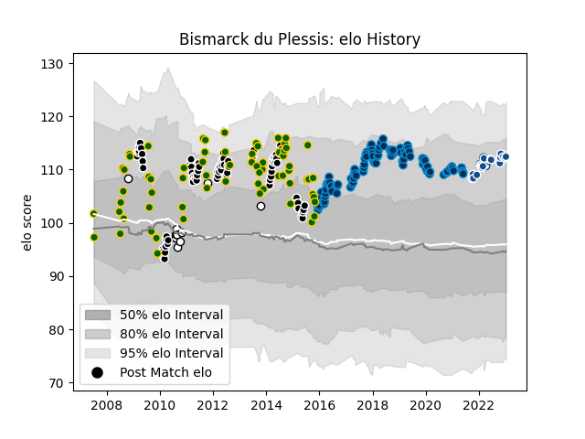

---  
layout: page  
title: Bismarck du Plessis  
date: 2022-12-14 11:29:29.287322  
categories: player  
---
# Bismarck du Plessis

## Positions: H

## Country: South Africa

## Current elo: 117.0

## Current Percentile: 95.0

# Elo History

# Match History

| Team                |   Appearances |   Win Rate |
|:--------------------|--------------:|-----------:|
| Montpellier Herault |           102 |   0.593137 |
| Sharks              |            85 |   0.617647 |
| South Africa        |            59 |   0.652542 |
| Bulls               |            19 |   0.526316 |
| Natal Sharks        |             8 |   0.625    |
| Blue Bulls          |             4 |   1        |

| Opponent                 |   Matches |   Win Rate |
|:-------------------------|----------:|-----------:|
| New Zealand              |        14 |   0.428571 |
| Australia                |        12 |   0.5      |
| Stormers                 |        12 |   0.416667 |
| Lions                    |        11 |   0.863636 |
| Bulls                    |         9 |   0.333333 |
| Castres Olympique        |         9 |   0.555556 |
| Wales                    |         8 |   0.875    |
| Stade Toulousain         |         8 |   0.125    |
| Argentina                |         8 |   0.875    |
| Racing 92                |         7 |   0.428571 |
| Lyon                     |         7 |   0.571429 |
| Brive                    |         7 |   0.571429 |
| Cheetahs                 |         7 |   0.857143 |
| Pau                      |         6 |   0.5      |
| New South Wales Waratahs |         6 |   0.333333 |
| Crusaders                |         6 |   0.166667 |
| La Rochelle              |         6 |   0.333333 |
| Chiefs                   |         6 |   0.333333 |
| Queensland Reds          |         6 |   0.833333 |
| Stade Francais Paris     |         6 |   0.666667 |
| Western Province         |         6 |   0.666667 |
| Toulon                   |         5 |   0.6      |
| Agen                     |         5 |   1        |
| Hurricanes               |         5 |   0.6      |
| Brumbies                 |         5 |   0.6      |
| Bordeaux Begles          |         5 |   0.7      |
| Clermont Auvergne        |         5 |   0.8      |
| Blues                    |         5 |   1        |
| England                  |         4 |   0.875    |
| Highlanders              |         4 |   0.75     |
| Leinster                 |         4 |   0.25     |
| Scotland                 |         4 |   0.75     |
| Western Force            |         3 |   1        |
| Glasgow Warriors         |         3 |   0.666667 |
| Bayonne                  |         3 |   1        |
| Sharks                   |         3 |   0.333333 |
| Edinburgh                |         3 |   0.333333 |
| Melbourne Rebels         |         3 |   1        |
| Grenoble                 |         3 |   1        |
| Oyonnax                  |         3 |   1        |
| Connacht                 |         3 |   0.333333 |
| Golden Lions             |         2 |   1        |
| Cardiff Blues            |         2 |   0.5      |
| Perpignan                |         2 |   0.5      |
| Griquas                  |         2 |   1        |
| Ireland                  |         2 |   0.5      |
| Munster                  |         2 |   0.5      |
| Harlequins               |         2 |   1        |
| Blue Bulls               |         2 |   0.5      |
| France                   |         2 |   0.5      |
| United States of America |         1 |   1        |
| Benetton Treviso         |         1 |   1        |
| Southern Kings           |         1 |   1        |
| Ospreys                  |         1 |   1        |
| Samoa                    |         1 |   1        |
| Sale Sharks              |         1 |   1        |
| Calvisano                |         1 |   1        |
| Dragons                  |         1 |   1        |
| Exeter Chiefs            |         1 |   0        |
| Japan                    |         1 |   0        |
| Italy                    |         1 |   1        |
| Fiji                     |         1 |   1        |
| Gloucester Rugby         |         1 |   1        |
| Zebre                    |         1 |   1        |