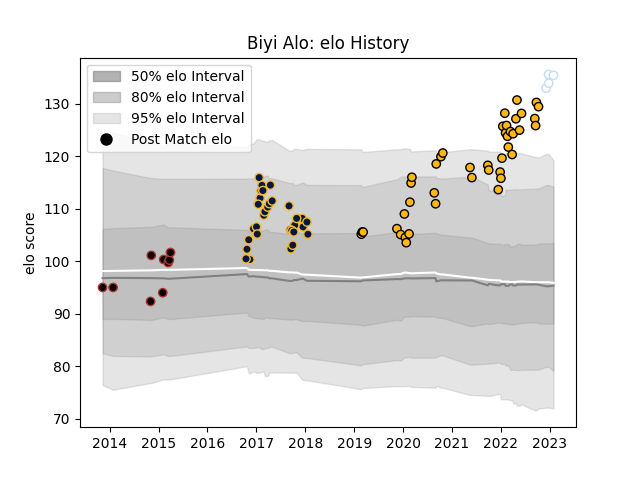

---  
layout: page  
title: Biyi Alo  
date: 2023-02-02 18:55:40.332780  
categories: player  
---
# Biyi Alo

## Positions: P

## Current elo: 135.0

## Current Percentile: 98.0

# Elo History

# Match History

| Team               |   Appearances |   Win Rate |
|:-------------------|--------------:|-----------:|
| Wasps              |            42 |   0.511905 |
| Worcester Warriors |            31 |   0.33871  |
| Saracens           |             9 |   1        |
| Racing 92          |             4 |   0.5      |

| Opponent             |   Matches |   Win Rate |
|:---------------------|----------:|-----------:|
| Harlequins           |         7 |   0.428571 |
| Bristol Rugby        |         6 |   0.666667 |
| Newcastle Falcons    |         6 |   0.333333 |
| Exeter Chiefs        |         6 |   0.5      |
| Saracens             |         5 |   0.8      |
| Northampton Saints   |         5 |   0.2      |
| Gloucester Rugby     |         5 |   0.4      |
| Bath Rugby           |         5 |   0.8      |
| Worcester Warriors   |         4 |   1        |
| Leicester Tigers     |         4 |   0.25     |
| Wasps                |         4 |   0.25     |
| Brive                |         4 |   0.25     |
| Sale Sharks          |         4 |   0        |
| London Irish         |         3 |   0.833333 |
| Oyonnax              |         2 |   0.5      |
| RC Enisei            |         2 |   0.5      |
| Bordeaux Begles      |         2 |   0        |
| La Rochelle          |         1 |   1        |
| London Welsh         |         1 |   1        |
| Munster              |         1 |   0        |
| Edinburgh            |         1 |   0        |
| Dragons              |         1 |   1        |
| Ospreys              |         1 |   1        |
| Connacht             |         1 |   0.5      |
| Cardiff Blues        |         1 |   1        |
| Stade Francais Paris |         1 |   0        |
| Stade Toulousain     |         1 |   1        |
| Toulon               |         1 |   1        |
| Agen                 |         1 |   1        |