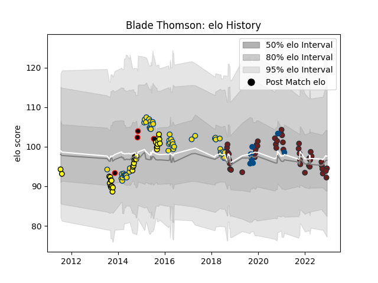

---  
layout: page  
title: Blade Thomson  
date: 2022-12-18 16:25:38.383769  
categories: player  
---
# Blade Thomson

## Positions: N8, FL

## Country: Scotland

## Current elo: 95.0

## Current Percentile: 35.0

# Elo History

# Match History

| Team              |   Appearances |   Win Rate |
|:------------------|--------------:|-----------:|
| Hurricanes        |            51 |   0.627451 |
| Scarlets          |            44 |   0.420455 |
| Taranaki          |            32 |   0.515625 |
| Scotland          |             7 |   0.571429 |
| New Zealand Maori |             4 |   1        |

| Opponent                 |   Matches |   Win Rate |
|:-------------------------|----------:|-----------:|
| Crusaders                |         8 |   0.5      |
| Highlanders              |         7 |   0.428571 |
| Blues                    |         6 |   1        |
| Chiefs                   |         5 |   0.4      |
| Benetton Treviso         |         5 |   0.8      |
| Brumbies                 |         5 |   0.4      |
| Ospreys                  |         5 |   0.9      |
| Wellington               |         4 |   0.25     |
| Bulls                    |         4 |   0.5      |
| Canterbury               |         4 |   0.25     |
| Cardiff Blues            |         4 |   0.25     |
| Sharks                   |         4 |   0.25     |
| Lions                    |         4 |   0.75     |
| Dragons                  |         4 |   0.25     |
| Manawatu                 |         3 |   0.333333 |
| Bay of Plenty            |         3 |   1        |
| Auckland                 |         3 |   0.666667 |
| Queensland Reds          |         3 |   1        |
| Tasman                   |         3 |   0.333333 |
| Japan                    |         3 |   0.666667 |
| Leinster                 |         3 |   0.333333 |
| Counties Manukau         |         3 |   0.5      |
| Hawke's Bay              |         2 |   0.5      |
| Southern Kings           |         2 |   1        |
| Stormers                 |         2 |   0        |
| Edinburgh                |         2 |   0        |
| Northland                |         2 |   1        |
| Toulon                   |         2 |   0        |
| Munster                  |         2 |   0        |
| Ulster                   |         2 |   0        |
| Waikato                  |         2 |   0.5      |
| Wales                    |         2 |   0.5      |
| Bayonne                  |         2 |   1        |
| Glasgow Warriors         |         2 |   0.5      |
| Jaguares                 |         2 |   1        |
| Southland                |         2 |   1        |
| United States of America |         1 |   1        |
| Western Force            |         1 |   1        |
| Cheetahs                 |         1 |   1        |
| Sunwolves                |         1 |   1        |
| Racing 92                |         1 |   0        |
| Connacht                 |         1 |   0        |
| Samoa                    |         1 |   1        |
| Ireland                  |         1 |   0        |
| Otago                    |         1 |   0        |
| New South Wales Waratahs |         1 |   0        |
| Melbourne Rebels         |         1 |   1        |
| Fiji                     |         1 |   1        |
| London Irish             |         1 |   1        |
| France                   |         1 |   1        |
| Georgia                  |         1 |   1        |
| Leicester Tigers         |         1 |   0        |
| Zebre                    |         1 |   1        |