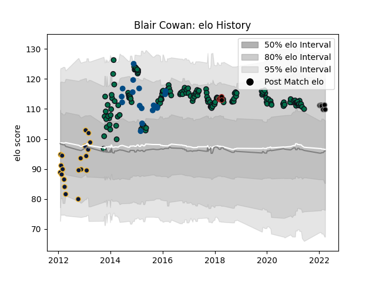

---  
layout: page  
title: Blair Cowan  
date: 2023-03-21 18:54:12.670135  
categories: player  
---
# Blair Cowan

Last updated: 2023-03-21
## Positions: FL, N8

## Country: Scotland

## Current elo: 110.0

## Current Percentile: 81.0

# Elo History

# Match History

| Team               |   Appearances |   Win Rate |
|:-------------------|--------------:|-----------:|
| London Irish       |           150 |   0.46     |
| Worcester Warriors |            20 |   0.4      |
| Scotland           |            19 |   0.315789 |
| Black Rams Tokyo   |             6 |   0.166667 |
| Saracens           |             4 |   0.5      |

| Opponent                        |   Matches |   Win Rate |
|:--------------------------------|----------:|-----------:|
| Wasps                           |        15 |  0.366667  |
| Bath Rugby                      |        12 |  0.0833333 |
| Newcastle Falcons               |        12 |  0.5       |
| Gloucester Rugby                |        11 |  0.272727  |
| Harlequins                      |        11 |  0.318182  |
| Leicester Tigers                |        11 |  0.272727  |
| Saracens                        |        10 |  0.2       |
| Sale Sharks                     |        10 |  0.2       |
| Northampton Saints              |         9 |  0.333333  |
| Exeter Chiefs                   |         9 |  0.111111  |
| Worcester Warriors              |         6 |  0.333333  |
| Doncaster                       |         5 |  1         |
| Cardiff Blues                   |         4 |  0.75      |
| Yorkshire Carnegie              |         4 |  1         |
| London Scottish                 |         3 |  1         |
| Edinburgh                       |         3 |  0.333333  |
| Jersey                          |         3 |  0.333333  |
| Australia                       |         2 |  0         |
| Rotherham Titans                |         2 |  1         |
| Nottingham                      |         2 |  1         |
| Richmond                        |         2 |  1         |
| Rovigo                          |         2 |  1         |
| South Africa                    |         2 |  0         |
| Wales                           |         2 |  0         |
| London Welsh                    |         2 |  1         |
| Argentina                       |         2 |  1         |
| London Irish                    |         2 |  0         |
| England                         |         2 |  0         |
| Bedford                         |         2 |  1         |
| Bizkaia Gernika RT              |         2 |  1         |
| Bristol Rugby                   |         2 |  0.5       |
| Cavalieri Prato                 |         2 |  1         |
| Ealing Trailfinders             |         2 |  1         |
| Cornish Pirates                 |         2 |  1         |
| Lusitanos XV                    |         2 |  1         |
| Grenoble                        |         2 |  1         |
| Italy                           |         2 |  0.5       |
| Ireland                         |         2 |  0         |
| Tonga                           |         1 |  1         |
| Yokohama Canon Eagles           |         1 |  0         |
| NTT Docomo Red Hurricanes Osaka |         1 |  1         |
| New Zealand                     |         1 |  0         |
| Urayasu D-Rocks                 |         1 |  0         |
| United States of America        |         1 |  1         |
| Toyota Verblitz                 |         1 |  0         |
| Toulon                          |         1 |  0         |
| Ospreys                         |         1 |  1         |
| Tokyo Sungoliath                |         1 |  0         |
| Pau                             |         1 |  1         |
| Canada                          |         1 |  1         |
| Scarlets                        |         1 |  1         |
| Leinster                        |         1 |  0         |
| Saitama Wild Knights            |         1 |  0         |
| Rugby Rovigo                    |         1 |  1         |
| Coventry                        |         1 |  1         |
| France                          |         1 |  0         |
| Stade Francais Paris            |         1 |  0         |