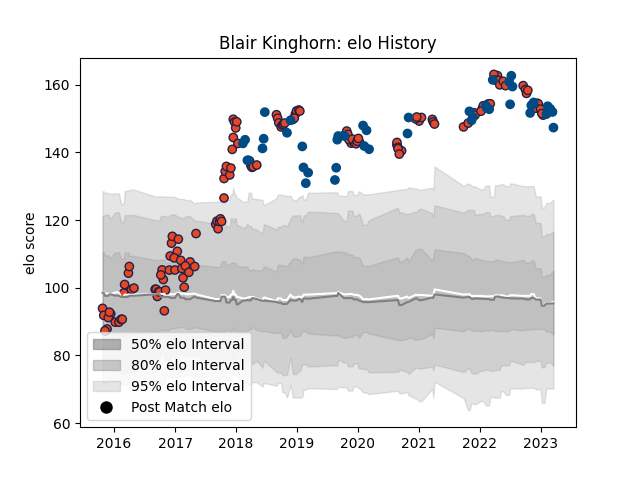

---  
layout: page  
title: Blair Kinghorn  
date: 2022-12-31 16:29:53.354349  
categories: player  
---
# Blair Kinghorn

## Positions: FB, FH

## Country: Scotland

## Current elo: 135.0

## Current Percentile: 98.0

# Elo History

# Match History

| Team      |   Appearances |   Win Rate |
|:----------|--------------:|-----------:|
| Edinburgh |           122 |   0.528689 |
| Scotland  |            40 |   0.55     |

| Opponent                 |   Matches |   Win Rate |
|:-------------------------|----------:|-----------:|
| Glasgow Warriors         |        15 |   0.6      |
| Dragons                  |         9 |   0.777778 |
| Scarlets                 |         8 |   0.625    |
| Munster                  |         8 |   0.125    |
| Benetton Treviso         |         8 |   0.75     |
| Cardiff Blues            |         7 |   0.285714 |
| Ulster                   |         7 |   0.142857 |
| Zebre                    |         7 |   0.714286 |
| Argentina                |         6 |   0.666667 |
| Connacht                 |         6 |   0.5      |
| France                   |         6 |   0.5      |
| Ospreys                  |         5 |   0.2      |
| Leinster                 |         4 |   0        |
| Wales                    |         4 |   0.25     |
| Ireland                  |         4 |   0        |
| London Irish             |         3 |   0.333333 |
| Italy                    |         3 |   1        |
| Bordeaux Begles          |         3 |   0.166667 |
| Georgia                  |         3 |   1        |
| Stade Francais Paris     |         3 |   0.666667 |
| England                  |         3 |   0.666667 |
| Southern Kings           |         3 |   1        |
| Newcastle Falcons        |         2 |   1        |
| Stormers                 |         2 |   0        |
| Montpellier Herault      |         2 |   0.5      |
| Japan                    |         2 |   0.5      |
| Timisoara Saracens       |         2 |   1        |
| Lions                    |         2 |   0        |
| Krasny Yar               |         2 |   1        |
| Cheetahs                 |         2 |   0.5      |
| Harlequins               |         2 |   1        |
| Toulon                   |         2 |   1        |
| Wasps                    |         1 |   1        |
| South Africa             |         1 |   0        |
| Tonga                    |         1 |   1        |
| United States of America |         1 |   0        |
| Agen                     |         1 |   1        |
| Sharks                   |         1 |   1        |
| Saracens                 |         1 |   0        |
| Russia                   |         1 |   1        |
| New Zealand              |         1 |   0        |
| Grenoble                 |         1 |   1        |
| Fiji                     |         1 |   1        |
| Chile                    |         1 |   1        |
| Castres Olympique        |         1 |   1        |
| Canada                   |         1 |   1        |
| Brive                    |         1 |   1        |
| Australia                |         1 |   0        |
| La Rochelle              |         1 |   0        |