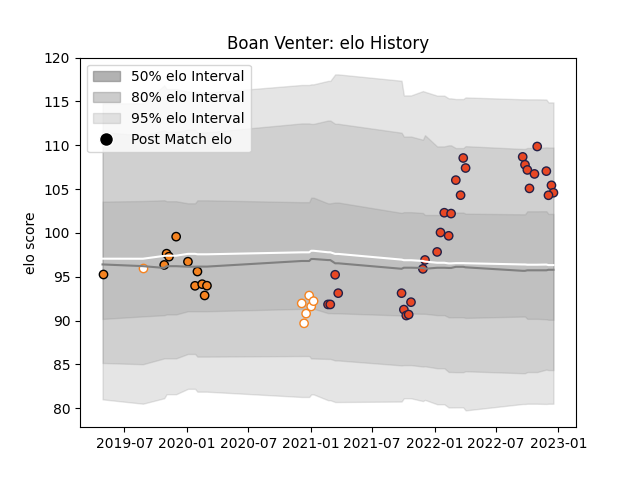

---  
layout: page  
title: Boan Venter  
date: 2023-02-02 19:12:36.511161  
categories: player  
---
# Boan Venter

## Positions: P

## Current elo: 92.0

## Current Percentile: 35.0

# Elo History

# Match History

| Team                |   Appearances |   Win Rate |
|:--------------------|--------------:|-----------:|
| Edinburgh           |            36 |   0.458333 |
| Cheetahs            |            11 |   0.363636 |
| Free State Cheetahs |             7 |   0.571429 |
| Griffons            |             1 |   1        |

| Opponent          |   Matches |   Win Rate |
|:------------------|----------:|-----------:|
| Zebre             |         4 |   0.75     |
| Cardiff Blues     |         4 |   0.5      |
| Dragons           |         3 |   0.666667 |
| Southern Kings    |         3 |   1        |
| Scarlets          |         3 |   0.333333 |
| Munster           |         3 |   0        |
| Glasgow Warriors  |         3 |   0        |
| Benetton Treviso  |         3 |   0.333333 |
| Connacht          |         3 |   0.666667 |
| Saracens          |         2 |   0.5      |
| Western Province  |         2 |   0.5      |
| Leinster          |         2 |   0        |
| Lions             |         2 |   0        |
| Stormers          |         2 |   0.25     |
| Ospreys           |         2 |   0.5      |
| Sharks            |         2 |   0.5      |
| Bulls             |         2 |   0.5      |
| Ulster            |         1 |   0        |
| Border Bulldogs   |         1 |   1        |
| Pau               |         1 |   1        |
| Pumas             |         1 |   1        |
| Golden Lions      |         1 |   0        |
| Natal Sharks      |         1 |   1        |
| Castres Olympique |         1 |   1        |
| Blue Bulls        |         1 |   0        |
| Griquas           |         1 |   1        |
| London Irish      |         1 |   0        |