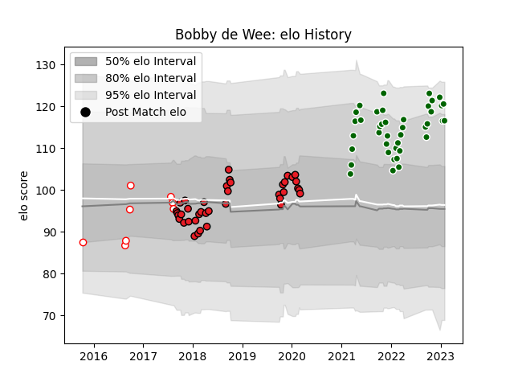

---  
layout: page  
title: Bobby de Wee  
date: 2022-12-28 12:57:01.363131  
categories: player  
---
# Bobby de Wee

## Positions: L

## Current elo: 128.0

## Current Percentile: 97.0

# Elo History

# Match History

| Team                |   Appearances |   Win Rate |
|:--------------------|--------------:|-----------:|
| Southern Kings      |            39 |  0.0769231 |
| Ealing Trailfinders |            36 |  0.888889  |
| Golden Lions        |             8 |  0.5       |

| Opponent               |   Matches |   Win Rate |
|:-----------------------|----------:|-----------:|
| Cheetahs               |         5 |   0        |
| Ampthill               |         4 |   1        |
| Benetton Treviso       |         4 |   0        |
| Ulster                 |         4 |   0        |
| Scarlets               |         4 |   0        |
| Nottingham             |         4 |   1        |
| Coventry               |         4 |   1        |
| Doncaster              |         4 |   0.5      |
| Jersey                 |         4 |   1        |
| Hartpury College       |         4 |   1        |
| Bedford                |         3 |   0.666667 |
| Richmond               |         3 |   1        |
| Munster                |         3 |   0        |
| London Scottish        |         3 |   1        |
| Glasgow Warriors       |         3 |   0.333333 |
| Dragons                |         3 |   0.333333 |
| Cornish Pirates        |         3 |   0.666667 |
| Connacht               |         3 |   0        |
| Griquas                |         2 |   0.5      |
| Edinburgh              |         2 |   0        |
| Leinster               |         2 |   0        |
| Natal Sharks           |         2 |   0.5      |
| Ospreys                |         2 |   0.5      |
| Cardiff Blues          |         2 |   0        |
| Zebre                  |         2 |   0        |
| Eastern Province Kings |         1 |   1        |
| Pumas                  |         1 |   0        |
| Boland Cavaliers       |         1 |   1        |
| Blue Bulls             |         1 |   0        |