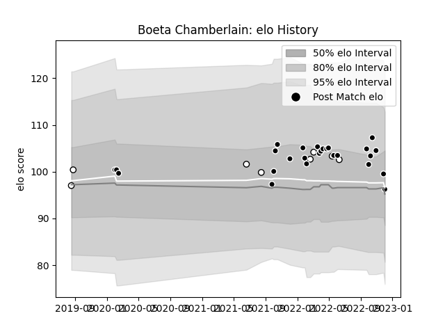

---  
layout: page  
title: Boeta Chamberlain  
date: 2022-12-14 11:17:26.593798  
categories: player  
---
# Boeta Chamberlain

## Positions: FH

## Current elo: 99.0

## Current Percentile: 53.0

# Elo History

# Match History

| Team         |   Appearances |   Win Rate |
|:-------------|--------------:|-----------:|
| Sharks       |            27 |   0.574074 |
| Natal Sharks |             8 |   0.75     |

| Opponent            |   Matches |   Win Rate |
|:--------------------|----------:|-----------:|
| Bulls               |         4 |       0.5  |
| Zebre               |         2 |       1    |
| Cardiff Blues       |         2 |       0    |
| Dragons             |         2 |       1    |
| Free State Cheetahs |         2 |       0.5  |
| Glasgow Warriors    |         2 |       0.5  |
| Golden Lions        |         2 |       1    |
| Stormers            |         2 |       0.25 |
| Ospreys             |         2 |       1    |
| Leinster            |         2 |       0.5  |
| Lions               |         2 |       1    |
| Munster             |         1 |       0    |
| Western Province    |         1 |       0    |
| Ulster              |         1 |       0    |
| Pumas               |         1 |       1    |
| Blue Bulls          |         1 |       1    |
| Hurricanes          |         1 |       0    |
| Harlequins          |         1 |       1    |
| Griquas             |         1 |       1    |
| Edinburgh           |         1 |       0    |
| Connacht            |         1 |       1    |
| Highlanders         |         1 |       1    |