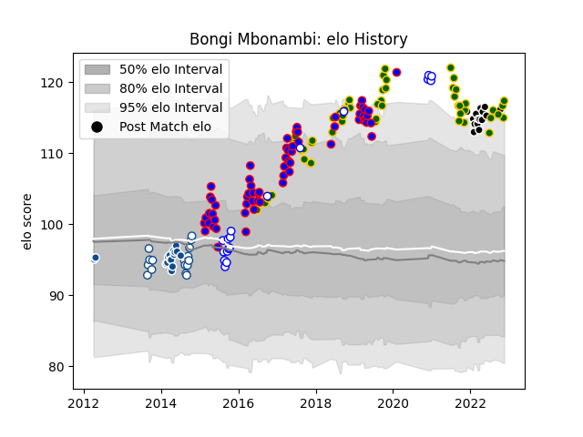

---  
layout: page  
title: Bongi Mbonambi  
date: 2023-01-06 00:14:54.315917  
categories: player  
---
# Bongi Mbonambi

## Positions: H

## Country: South Africa

## Current elo: 126.0

## Current Percentile: 95.0

# Elo History

# Match History

| Team             |   Appearances |   Win Rate |
|:-----------------|--------------:|-----------:|
| South Africa     |            63 |   0.634921 |
| Stormers         |            63 |   0.595238 |
| Blue Bulls       |            23 |   0.434783 |
| Western Province |            20 |   0.7      |
| Bulls            |            19 |   0.5      |
| Sharks           |            19 |   0.763158 |

| Opponent                 |   Matches |   Win Rate |
|:-------------------------|----------:|-----------:|
| Bulls                    |        11 |   0.727273 |
| Lions                    |        10 |   0.55     |
| Argentina                |         9 |   0.777778 |
| Griquas                  |         9 |   0.888889 |
| New Zealand              |         9 |   0.388889 |
| Golden Lions             |         8 |   0.125    |
| Australia                |         8 |   0.4375   |
| Cheetahs                 |         8 |   0.75     |
| Free State Cheetahs      |         7 |   0.714286 |
| Sharks                   |         7 |   0.428571 |
| England                  |         7 |   0.571429 |
| Brumbies                 |         6 |   0.666667 |
| Wales                    |         6 |   0.666667 |
| France                   |         6 |   0.833333 |
| Jaguares                 |         5 |   0.6      |
| Ireland                  |         5 |   0.4      |
| Stormers                 |         5 |   0.3      |
| Sunwolves                |         5 |   0.9      |
| Hurricanes               |         5 |   0.2      |
| Natal Sharks             |         4 |   0.25     |
| Western Province         |         4 |   0        |
| Pumas                    |         4 |   1        |
| Italy                    |         4 |   0.75     |
| Blue Bulls               |         4 |   0.5      |
| Chiefs                   |         4 |   0.375    |
| Blues                    |         4 |   0.75     |
| New South Wales Waratahs |         3 |   0.333333 |
| Eastern Province Kings   |         3 |   1        |
| Western Force            |         3 |   0.666667 |
| Highlanders              |         3 |   0        |
| Crusaders                |         3 |   0.5      |
| British and Irish Lions  |         3 |   0.666667 |
| Melbourne Rebels         |         3 |   1        |
| Southern Kings           |         2 |   1        |
| Japan                    |         2 |   1        |
| Scotland                 |         2 |   1        |
| Queensland Reds          |         2 |   0.5      |
| Ulster                   |         1 |   0        |
| Bordeaux Begles          |         1 |   1        |
| Benetton Treviso         |         1 |   1        |
| Georgia                  |         1 |   1        |
| Scarlets                 |         1 |   1        |
| Ospreys                  |         1 |   1        |
| Glasgow Warriors         |         1 |   1        |
| Namibia                  |         1 |   1        |
| Leinster                 |         1 |   1        |
| Connacht                 |         1 |   1        |
| Dragons                  |         1 |   1        |
| Harlequins               |         1 |   1        |
| Edinburgh                |         1 |   0        |
| Zebre                    |         1 |   1        |