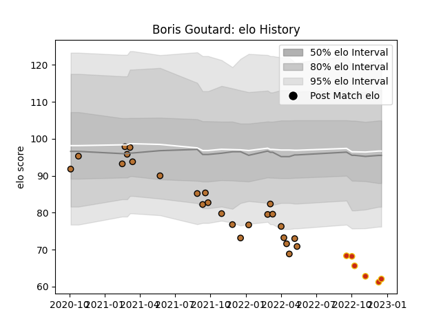

---  
layout: page  
title: Boris Goutard  
date: 2023-01-06 00:14:35.632712  
categories: player  
---
# Boris Goutard

## Positions: FB, FH

## Current elo: 68.0

## Current Percentile: 1.0

# Elo History

# Match History

| Team      |   Appearances |   Win Rate |
|:----------|--------------:|-----------:|
| Narbonne  |            33 |   0.318182 |
| Perpignan |             7 |   0.142857 |

| Opponent                   |   Matches |   Win Rate |
|:---------------------------|----------:|-----------:|
| La Rochelle                |         2 |       0    |
| Oyonnax                    |         2 |       0    |
| Aurillac                   |         2 |       0    |
| US Bressane                |         2 |       0.5  |
| Grenoble                   |         2 |       0.25 |
| Blagnac                    |         2 |       1    |
| Suresnes                   |         2 |       0.5  |
| Aubenas                    |         2 |       0.5  |
| Montauban                  |         2 |       0    |
| Dijon                      |         2 |       0.5  |
| Nevers                     |         2 |       0    |
| Albi                       |         1 |       0    |
| Provence Rugby             |         1 |       1    |
| Racing 92                  |         1 |       0    |
| Stade Francais Paris       |         1 |       0    |
| Tarbes                     |         1 |       1    |
| Rouen                      |         1 |       1    |
| Glasgow Warriors           |         1 |       0    |
| Mont-de-Marsan             |         1 |       0    |
| Dax                        |         1 |       0    |
| Colomiers                  |         1 |       0    |
| Cognac Saint Jean d'Angély |         1 |       1    |
| Chambery                   |         1 |       0    |
| Castres Olympique          |         1 |       1    |
| Carcassonne                |         1 |       0    |
| Bristol Rugby              |         1 |       0    |
| Beziers                    |         1 |       0    |
| Bayonne                    |         1 |       0    |
| Vannes                     |         1 |       0    |