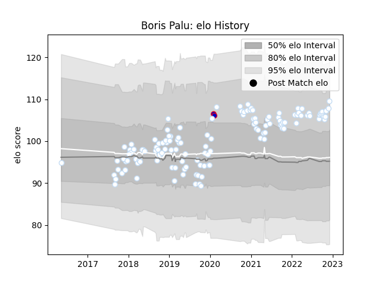

---  
layout: page  
title: Boris Palu  
date: 2023-01-06 00:22:18.344444  
categories: player  
---
# Boris Palu

## Positions: L, FL

## Country: France

## Current elo: 115.0

## Current Percentile: 81.0

# Elo History

# Match History

| Team      |   Appearances |   Win Rate |
|:----------|--------------:|-----------:|
| Racing 92 |           139 |   0.604317 |
| France    |             2 |   1        |

| Opponent             |   Matches |   Win Rate |
|:---------------------|----------:|-----------:|
| Castres Olympique    |        13 |   0.653846 |
| Stade Toulousain     |        11 |   0.272727 |
| Stade Francais Paris |        11 |   0.636364 |
| La Rochelle          |        11 |   0.454545 |
| Toulon               |        10 |   0.7      |
| Clermont Auvergne    |        10 |   0.65     |
| Montpellier Herault  |         9 |   0.666667 |
| Lyon                 |         8 |   0.5      |
| Agen                 |         7 |   0.785714 |
| Bordeaux Begles      |         7 |   0.428571 |
| Pau                  |         7 |   0.857143 |
| Brive                |         5 |   0.8      |
| Perpignan            |         5 |   0.8      |
| Bayonne              |         4 |   0.25     |
| Saracens             |         3 |   0.666667 |
| Munster              |         3 |   0.833333 |
| Leicester Tigers     |         3 |   1        |
| Leinster             |         2 |   0        |
| Ospreys              |         2 |   1        |
| Grenoble             |         2 |   1        |
| Scarlets             |         2 |   1        |
| Italy                |         1 |   1        |
| Harlequins           |         1 |   0        |
| Exeter Chiefs        |         1 |   0        |
| England              |         1 |   1        |
| Biarritz Olympique   |         1 |   0        |
| Ulster               |         1 |   0        |