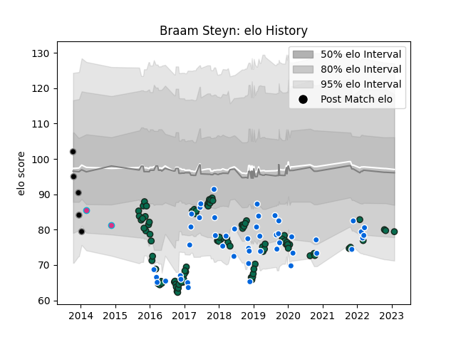

---  
layout: page  
title: Braam Steyn  
date: 2023-01-30 11:45:54.402041  
categories: player  
---
# Braam Steyn

## Positions: FL, N8

## Country: Italy

## Current elo: 79.0

## Current Percentile: 12.0

# Elo History

# Match History

| Team             |   Appearances |   Win Rate |
|:-----------------|--------------:|-----------:|
| Benetton Treviso |            95 |   0.315789 |
| Italy            |            48 |   0.208333 |
| Calvisano        |             5 |   0.1      |
| Zebre            |             2 |   0.5      |

| Opponent             |   Matches |   Win Rate |
|:---------------------|----------:|-----------:|
| Zebre                |        13 |  0.692308  |
| Munster              |         8 |  0         |
| Glasgow Warriors     |         8 |  0.125     |
| Scarlets             |         7 |  0         |
| Leinster             |         7 |  0.0714286 |
| Edinburgh            |         7 |  0.428571  |
| Ireland              |         7 |  0         |
| Scotland             |         6 |  0         |
| Ospreys              |         6 |  0.333333  |
| England              |         6 |  0         |
| Dragons              |         6 |  0.583333  |
| Cardiff Blues        |         5 |  0.4       |
| Ulster               |         5 |  0         |
| Wales                |         5 |  0.2       |
| Connacht             |         4 |  0.25      |
| France               |         4 |  0         |
| South Africa         |         3 |  0.333333  |
| Southern Kings       |         3 |  1         |
| La Rochelle          |         2 |  0         |
| Newcastle Falcons    |         2 |  0         |
| New Zealand          |         2 |  0         |
| Leicester Tigers     |         2 |  0         |
| Japan                |         2 |  0.5       |
| Argentina            |         2 |  0         |
| Bayonne              |         2 |  1         |
| Australia            |         2 |  0         |
| Gloucester Rugby     |         2 |  0         |
| Georgia              |         2 |  1         |
| Fiji                 |         2 |  0.5       |
| Harlequins           |         2 |  0.5       |
| Bucuresti            |         2 |  0         |
| Uruguay              |         1 |  1         |
| Bath Rugby           |         1 |  0         |
| Toulon               |         1 |  0         |
| Tonga                |         1 |  0         |
| Stade Francais Paris |         1 |  0         |
| Canada               |         1 |  1         |
| Brive                |         1 |  0.5       |
| Russia               |         1 |  1         |
| Cheetahs             |         1 |  1         |
| Northampton Saints   |         1 |  0         |
| Namibia              |         1 |  1         |
| Lyon                 |         1 |  1         |
| Grenoble             |         1 |  1         |
| Agen                 |         1 |  0         |