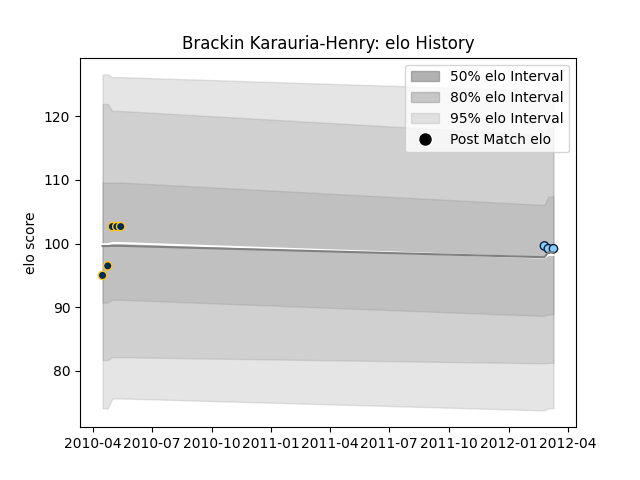

---  
layout: page  
title: Brackin Karauria-Henry  
date: 2023-03-17 17:02:08.270714  
categories: player  
---
# Brackin Karauria-Henry

## Positions: C, FB

## Current elo: 114.0

## Current Percentile: 75.0

# Elo History

# Match History

| Team                     |   Appearances |   Win Rate |
|:-------------------------|--------------:|-----------:|
| Urayasu D-Rocks          |            53 |   0.509434 |
| Brumbies                 |             5 |   0.4      |
| New South Wales Waratahs |             3 |   0.333333 |
| Mitsubishi Dynaboars     |             1 |   1        |

| Opponent                          |   Matches |   Win Rate |
|:----------------------------------|----------:|-----------:|
| Saitama Wild Knights              |         6 |   0.333333 |
| Toyota Verblitz                   |         6 |   0.333333 |
| Kobelco Kobe Steelers             |         6 |   0.166667 |
| Black Rams Tokyo                  |         4 |   0.75     |
| Green Rockets Tokatsu             |         4 |   0.5      |
| Toyota Industries Shuttles Aichi  |         3 |   1        |
| Toshiba Brave Lupus Tokyo         |         3 |   0.666667 |
| Shizuoka Blue Revs                |         3 |   0        |
| Yokohama Canon Eagles             |         3 |   0.666667 |
| Kubota Spears Funabashi Tokyo-Bay |         3 |   0.666667 |
| Kyuden Voltex                     |         2 |   1        |
| Munakata Sanix Blues              |         2 |   1        |
| NTT Docomo Red Hurricanes Osaka   |         2 |   1        |
| Queensland Reds                   |         2 |   0.5      |
| Tokyo Sungoliath                  |         2 |   0        |
| Highlanders                       |         2 |   0.5      |
| Hanazono Kintetsu Liners          |         2 |   0.5      |
| Melbourne Rebels                  |         1 |   1        |
| Mie Honda Heat                    |         1 |   1        |
| Coca-Cola Red Sparks              |         1 |   1        |
| New South Wales Waratahs          |         1 |   0        |
| Hurricanes                        |         1 |   0        |
| Crusaders                         |         1 |   0        |
| Mitsubishi Dynaboars              |         1 |   0        |