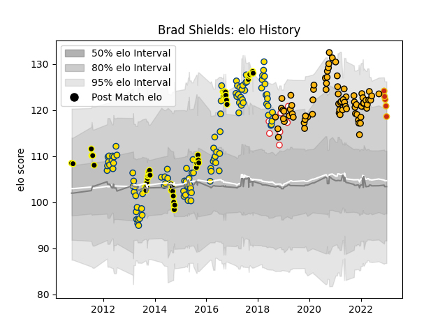

---  
layout: page  
title: Brad Shields  
date: 2022-12-14 11:30:36.714844  
categories: player  
---
# Brad Shields

## Positions: FL, N8

## Country: England

## Current elo: 112.0

## Current Percentile: 90.0

# Elo History

# Match History

| Team       |   Appearances |   Win Rate |
|:-----------|--------------:|-----------:|
| Hurricanes |           104 |   0.677885 |
| Wasps      |            75 |   0.466667 |
| Wellington |            47 |   0.595745 |
| England    |             8 |   0.4375   |
| Perpignan  |             3 |   0.333333 |

| Opponent                 |   Matches |   Win Rate |
|:-------------------------|----------:|-----------:|
| Chiefs                   |        14 |   0.5      |
| Highlanders              |        13 |   0.538462 |
| Blues                    |        12 |   0.75     |
| Crusaders                |        12 |   0.583333 |
| Bath Rugby               |        10 |   0.65     |
| Gloucester Rugby         |         7 |   0.285714 |
| North Harbour            |         7 |   0.857143 |
| Leicester Tigers         |         6 |   0.333333 |
| Northampton Saints       |         6 |   0.5      |
| London Irish             |         6 |   0.583333 |
| Northland                |         6 |   0.833333 |
| Brumbies                 |         6 |   0.5      |
| Bristol Rugby            |         6 |   0.666667 |
| Harlequins               |         6 |   0.333333 |
| Lions                    |         6 |   0.833333 |
| Exeter Chiefs            |         6 |   0.5      |
| Melbourne Rebels         |         5 |   1        |
| Worcester Warriors       |         5 |   0.8      |
| Sale Sharks              |         5 |   0        |
| New South Wales Waratahs |         5 |   0.8      |
| Queensland Reds          |         5 |   0.8      |
| Bulls                    |         5 |   0.6      |
| Taranaki                 |         5 |   0.8      |
| Saracens                 |         4 |   0.5      |
| Bay of Plenty            |         4 |   1        |
| Sharks                   |         4 |   0.75     |
| Stormers                 |         4 |   0.5      |
| Western Force            |         4 |   1        |
| Counties Manukau         |         4 |   0.75     |
| Canterbury               |         4 |   0.25     |
| South Africa             |         3 |   0.333333 |
| Stade Toulousain         |         3 |   0.333333 |
| Tasman                   |         3 |   0        |
| Waikato                  |         3 |   0.333333 |
| Auckland                 |         3 |   0.333333 |
| Newcastle Falcons        |         3 |   0.666667 |
| Cheetahs                 |         3 |   0.666667 |
| Jaguares                 |         2 |   1        |
| Sunwolves                |         2 |   1        |
| Hawke's Bay              |         2 |   0        |
| Otago                    |         2 |   0        |
| Southland                |         2 |   1        |
| Munster                  |         2 |   0        |
| Manawatu                 |         2 |   0.5      |
| Leinster                 |         1 |   0        |
| Southern Kings           |         1 |   1        |
| Scotland                 |         1 |   0.5      |
| Italy                    |         1 |   1        |
| Australia                |         1 |   1        |
| Edinburgh                |         1 |   0        |
| New Zealand              |         1 |   0        |
| British and Irish Lions  |         1 |   0.5      |
| Wales                    |         1 |   0        |
| Bordeaux Begles          |         1 |   1        |