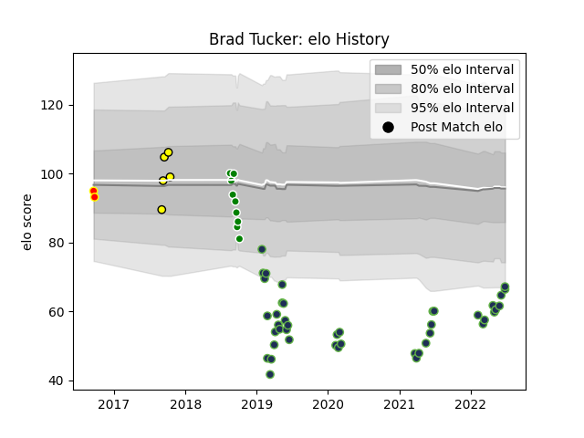

---  
layout: page  
title: Brad Tucker  
date: 2023-03-21 18:33:06.557120  
categories: player  
---
# Brad Tucker

Last updated: 2023-03-21
## Positions: L, FL

## Current elo: 67.0

## Current Percentile: 4.0

# Elo History

# Match History

| Team              |   Appearances |   Win Rate |
|:------------------|--------------:|-----------:|
| Seattle Seawolves |            43 |   0.523256 |
| Manawatu          |             9 |   0.222222 |
| Taranaki          |             5 |   0.8      |
| Waikato           |             2 |   0.25     |

| Opponent               |   Matches |   Win Rate |
|:-----------------------|----------:|-----------:|
| Utah Warriors          |         6 |   0.583333 |
| Toronto Arrows         |         5 |   0.6      |
| Houston SaberCats      |         5 |   0.6      |
| San Diego Legion       |         4 |   0.25     |
| Rugby New York         |         3 |   0.666667 |
| R.U. New York          |         3 |   0.666667 |
| NOLA Gold              |         3 |   0.333333 |
| L. A. Giltinis         |         3 |   0.333333 |
| Glendale Raptors       |         2 |   1        |
| Taranaki               |         2 |   0.25     |
| Counties Manukau       |         2 |   0.5      |
| New England Free Jacks |         2 |   0.5      |
| Austin Elite Rugby     |         2 |   1        |
| Canterbury             |         2 |   0.5      |
| Old Glory DC           |         2 |   0        |
| Bay of Plenty          |         2 |   1        |
| Austin Gilgronis       |         2 |   0        |
| Waikato                |         1 |   1        |
| Tasman                 |         1 |   0        |
| Auckland               |         1 |   1        |
| North Harbour          |         1 |   0        |
| Otago                  |         1 |   0        |
| Northland              |         1 |   0        |
| Hawke's Bay            |         1 |   0        |
| Dallas Jackals         |         1 |   1        |
| Wellington             |         1 |   0        |