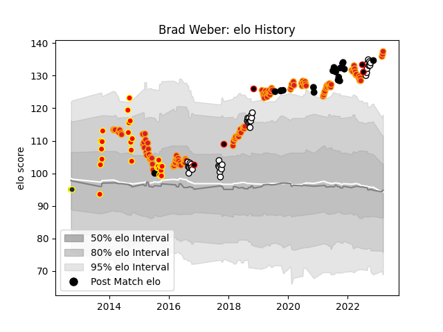

---  
layout: page  
title: Brad Weber  
date: 2023-03-17 16:59:52.693745  
categories: player  
---
# Brad Weber

## Positions: SH

## Country: New Zealand

## Current elo: 137.0

## Current Percentile: 99.0

# Elo History

# Match History

| Team              |   Appearances |   Win Rate |
|:------------------|--------------:|-----------:|
| Chiefs            |           115 |   0.617391 |
| Hawke's Bay       |            38 |   0.355263 |
| Waikato           |            25 |   0.44     |
| New Zealand       |            18 |   0.777778 |
| New Zealand Maori |             5 |   0.8      |
| Otago             |             2 |   1        |

| Opponent                 |   Matches |   Win Rate |
|:-------------------------|----------:|-----------:|
| Crusaders                |        18 |   0.5      |
| Highlanders              |        16 |   0.40625  |
| Hurricanes               |        14 |   0.392857 |
| Blues                    |        13 |   0.615385 |
| Counties Manukau         |         7 |   0.285714 |
| Wellington               |         7 |   0.142857 |
| Manawatu                 |         7 |   0.857143 |
| Bay of Plenty            |         6 |   0.666667 |
| Tasman                   |         6 |   0.166667 |
| New South Wales Waratahs |         6 |   0.666667 |
| Queensland Reds          |         5 |   0.8      |
| Moana Pasifika           |         5 |   1        |
| North Harbour            |         5 |   0.6      |
| Melbourne Rebels         |         5 |   0.8      |
| Southland                |         5 |   0.8      |
| Canterbury               |         5 |   0        |
| Brumbies                 |         5 |   0.8      |
| Otago                    |         4 |   0.25     |
| Sharks                   |         4 |   0.5      |
| Stormers                 |         4 |   1        |
| Auckland                 |         4 |   0.25     |
| Western Force            |         4 |   1        |
| Jaguares                 |         4 |   0.5      |
| Lions                    |         3 |   0.333333 |
| Australia                |         3 |   0.666667 |
| Wales                    |         3 |   1        |
| Waikato                  |         3 |   0.166667 |
| Bulls                    |         3 |   1        |
| Taranaki                 |         3 |   0.333333 |
| Sunwolves                |         3 |   0.666667 |
| Argentina                |         3 |   0.666667 |
| South Africa             |         2 |   0.5      |
| Canada                   |         2 |   1        |
| Northland                |         2 |   0.5      |
| United States of America |         2 |   1        |
| Ireland                  |         2 |   0.5      |
| Samoa                    |         1 |   1        |
| Fiji                     |         1 |   1        |
| Fijian Drua              |         1 |   1        |
| Cheetahs                 |         1 |   1        |
| France                   |         1 |   0        |
| Hawke's Bay              |         1 |   1        |
| Tonga                    |         1 |   1        |
| Namibia                  |         1 |   1        |
| Italy                    |         1 |   1        |
| Southern Kings           |         1 |   1        |