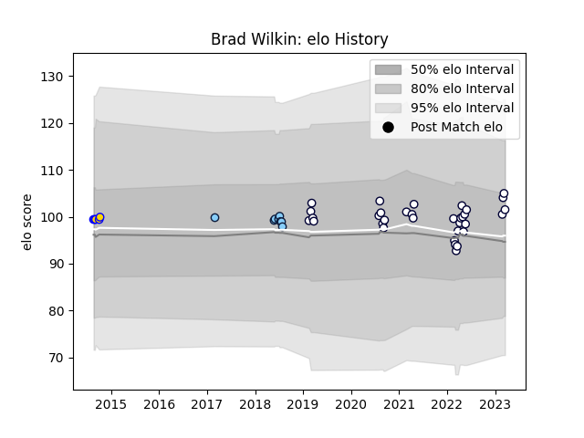

---  
layout: page  
title: Brad Wilkin  
date: 2023-03-16 20:00:05.188756  
categories: player  
---
# Brad Wilkin

## Positions: FL

## Current elo: 105.0

## Current Percentile: 74.0

# Elo History

# Match History

| Team                     |   Appearances |   Win Rate |
|:-------------------------|--------------:|-----------:|
| Melbourne Rebels         |            32 |      0.375 |
| New South Wales Waratahs |             8 |      0.625 |
| Brisbane City            |             5 |      0.6   |

| Opponent                 |   Matches |   Win Rate |
|:-------------------------|----------:|-----------:|
| Western Force            |         7 |   0.571429 |
| Brumbies                 |         6 |   0.5      |
| Queensland Reds          |         6 |   0.166667 |
| New South Wales Waratahs |         4 |   0.5      |
| Highlanders              |         3 |   1        |
| Chiefs                   |         2 |   0        |
| Fijian Drua              |         2 |   0.5      |
| Hurricanes               |         2 |   0        |
| Lions                    |         2 |   0        |
| Perth Spirit             |         1 |   1        |
| Sydney Stars             |         1 |   1        |
| Sunwolves                |         1 |   1        |
| Sharks                   |         1 |   0        |
| Blues                    |         1 |   0        |
| North Harbour Rays       |         1 |   1        |
| Moana Pasifika           |         1 |   1        |
| Melbourne Rebels         |         1 |   1        |
| Greater Sydney Rams      |         1 |   0        |
| Crusaders                |         1 |   0        |
| Melbourne Rising         |         1 |   0        |