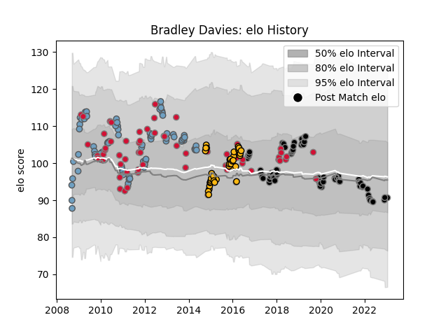

---  
layout: page  
title: Bradley Davies  
date: 2022-12-12 15:38:06.099707  
categories: player  
---
# Bradley Davies

## Positions: L

## Country: Wales

## Current elo: 103.0

## Current Percentile: 74.0

# Elo History

# Match History

| Team          |   Appearances |   Win Rate |
|:--------------|--------------:|-----------:|
| Cardiff Blues |            86 |   0.563953 |
| Ospreys       |            75 |   0.44     |
| Wales         |            60 |   0.491667 |
| Wasps         |            38 |   0.526316 |

| Opponent           |   Matches |   Win Rate |
|:-------------------|----------:|-----------:|
| Dragons            |        16 |   0.84375  |
| Leinster           |        15 |   0.266667 |
| Edinburgh          |        15 |   0.6      |
| Scarlets           |        14 |   0.142857 |
| Munster            |        13 |   0.307692 |
| Ulster             |        10 |   0.3      |
| Cardiff Blues      |         9 |   0.666667 |
| Connacht           |         9 |   0.666667 |
| Ireland            |         8 |   0.5625   |
| Glasgow Warriors   |         7 |   0.285714 |
| Australia          |         7 |   0        |
| South Africa       |         6 |   0.166667 |
| Northampton Saints |         6 |   0.666667 |
| Exeter Chiefs      |         6 |   0.166667 |
| New Zealand        |         6 |   0        |
| France             |         6 |   0.5      |
| Ospreys            |         6 |   0.25     |
| Saracens           |         5 |   0.1      |
| Sale Sharks        |         5 |   0.6      |
| Italy              |         5 |   1        |
| Scotland           |         5 |   1        |
| Toulon             |         5 |   0.4      |
| London Irish       |         5 |   1        |
| Zebre              |         5 |   0.8      |
| Bath Rugby         |         5 |   0.6      |
| Harlequins         |         5 |   0.8      |
| Gloucester Rugby   |         5 |   0.8      |
| Benetton Treviso   |         5 |   0.8      |
| England            |         5 |   0.2      |
| Castres Olympique  |         4 |   0.75     |
| Cheetahs           |         3 |   0.666667 |
| Fiji               |         3 |   1        |
| Leicester Tigers   |         3 |   0.166667 |
| Racing 92          |         3 |   0.666667 |
| Japan              |         2 |   0.5      |
| Worcester Warriors |         2 |   1        |
| Bulls              |         2 |   0        |
| Samoa              |         2 |   0.5      |
| Argentina          |         2 |   1        |
| Pau                |         1 |   1        |
| Clermont Auvergne  |         1 |   0        |
| Canada             |         1 |   1        |
| Calvisano          |         1 |   1        |
| Sharks             |         1 |   0        |
| Newcastle Falcons  |         1 |   0.5      |
| Southern Kings     |         1 |   1        |
| Stade Toulousain   |         1 |   1        |
| Stormers           |         1 |   0        |
| Namibia            |         1 |   1        |
| Lions              |         1 |   0        |
| Uruguay            |         1 |   1        |
| Wasps              |         1 |   1        |
| Aironi             |         1 |   1        |