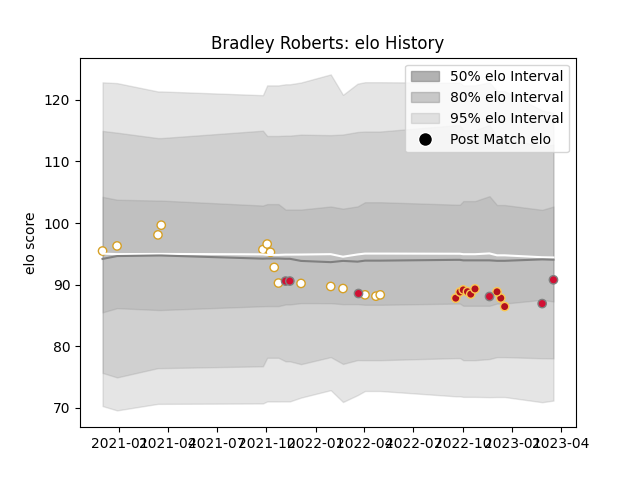

---  
layout: page  
title: Bradley Roberts  
date: 2022-11-22 11:47:20.568047  
categories: player  
---
# Bradley Roberts

## Positions: H

## Country: Wales

## Current elo: 93.0

## Current Percentile: 43.0

# Elo History

# Match History

| Team    |   Appearances |   Win Rate |
|:--------|--------------:|-----------:|
| Ulster  |            15 |   0.733333 |
| Dragons |             6 |   0.333333 |
| Wales   |             4 |   0.25     |

| Opponent         |   Matches |   Win Rate |
|:-----------------|----------:|-----------:|
| Edinburgh        |         3 |   0.666667 |
| Benetton Treviso |         2 |   0.5      |
| Ospreys          |         2 |   0.5      |
| Munster          |         2 |   0.5      |
| Zebre            |         2 |   1        |
| Dragons          |         2 |   1        |
| Connacht         |         2 |   0.5      |
| Fiji             |         1 |   1        |
| Georgia          |         1 |   0        |
| Bulls            |         1 |   0        |
| Italy            |         1 |   0        |
| Lions            |         1 |   1        |
| Cardiff Blues    |         1 |   0        |
| Scarlets         |         1 |   1        |
| Sharks           |         1 |   0        |
| South Africa     |         1 |   0        |
| Glasgow Warriors |         1 |   1        |